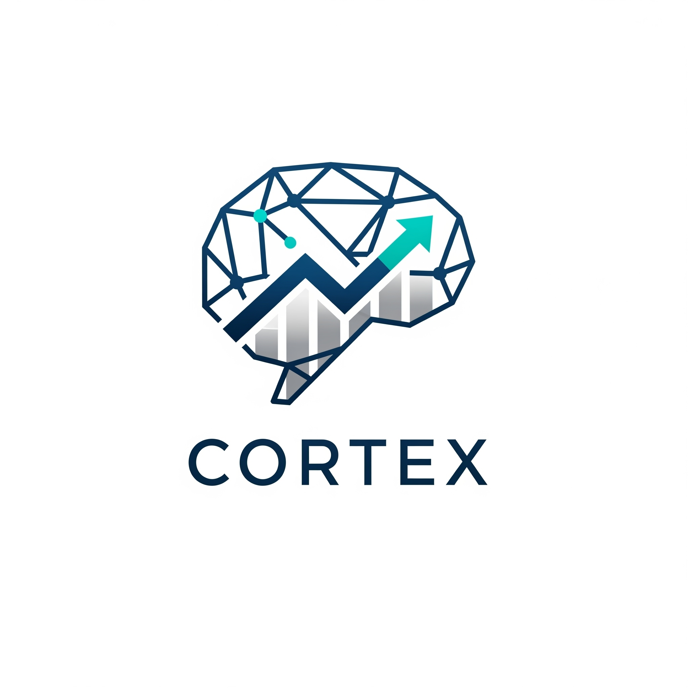

# cuantitativa y cualitativamente

<p align="center">
  
</p><p align="center"><strong>데이터 기반의 암호화폐 투자 전략을 손쉽게 검증하고, 커뮤니티와 공유하며, 자동매매를 실행하는 올인원 퀀트 플랫폼</strong></p><p align="center">    
    
</p>

---

\***\*Project: Cortex\*\***는 개인 투자자들이 복잡한 프로그래밍 지식 없이도 자신만의 투자 아이디어를 체계적으로 검증하고, 더 나아가 자동매매 시스템으로 전환할 수 있도록 돕기 위해 탄생했습니다. 감정에 휘둘리는 투자가 아닌, 데이터와 시스템에 기반한 투자를 지향합니다.

## ✨ 핵심 기능 (Core Features)

- \***\*🚀 고도화된 백테스팅:\*\*** 롱/숏 포지션, 수수료 및 슬리피지를 모두 고려한 현실적인 과거 성과 시뮬레이션을 제공하며, 샤프 지수 등 전문가 수준의 성과 지표를 확인할 수 있습니다.
- \***\*🎨 비주얼 전략 빌더:\*\*** 코딩 없이, 레고 블록을 조립하듯 자신만의 매매 규칙과 기술 지표를 조합하여 독창적인 투자 전략을 만들 수 있습니다.
- \***\*👥 커뮤니티와 전략 공유:\*\*** 우수한 백테스팅 결과를 다른 사용자들과 공유하고, 집단 지성을 통해 함께 성장하는 전략 생태계에 참여할 수 있습니다.
- \***\*🤖 실전 자동매매:\*\*** 검증된 전략을 실제 거래소와 연동하여 24시간 자동으로 매매를 실행합니다.

## 🛠️ 기술 스택 (Tech Stack)

| Category               | Technologies                                                                                                                                                                                                                                                                                                                                                                                                                                          |
| :--------------------- | :---------------------------------------------------------------------------------------------------------------------------------------------------------------------------------------------------------------------------------------------------------------------------------------------------------------------------------------------------------------------------------------------------------------------------------------------------- |
| \***\*Frontend\*\***   |     |
| \***\*Backend\*\***    |                                                                                                                                     |
| \***\*Database\*\***   |                                                                                                                |
| \***\*Deployment\*\*** |                                                                                                                                          |

## 🚀 시작하기 (Getting Started)

프로젝트를 로컬 환경에서 실행하고 개발에 참여하기 위한 모든 절차는 아래 시작 가이드 문서에 상세히 기술되어 있습니다.

```bash
# 1. 저장소 클론
git clone [https://github.com/YourUsername/Project-Cortex.git](https://github.com/YourUsername/Project-Cortex.git)

# 2. 프로젝트 폴더로 이동
cd Project-Cortex

# 3. 상세 가이드 확인 후 진행
# -> docs/01_Getting_Started.md
```

**➡️ [전체 설치 및 실행 가이드 보기](./docs/01_Getting_Started.md)**

## 📚 프로젝트 문서 (Documentation)

본 프로젝트는 체계적인 문서화를 통해 관리됩니다. 모든 기획, 설계, API 명세 등은 `docs` 폴더에서 확인하실 수 있습니다.

**➡️ [프로젝트 문서 전체 보기](./docs/)**

## 🗺️ 개발 로드맵 (Roadmap)

프로젝트의 전체 개발 계획과 각 기능의 진행 상황은 아래 로드맵 문서에서 실시간으로 확인하실 수 있습니다.

**➡️ [전체 개발 로드맵 보기](./PROJECT_ROADMAP.md)**

---
