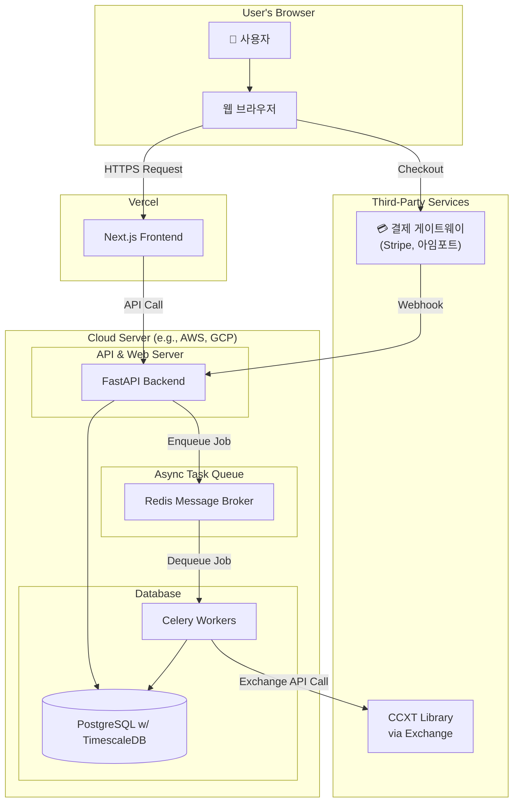

# 🏗️ 03. 아키텍처 (Architecture)

이 문서는 'Project: Cortex'의 전체 시스템 구성과 데이터 흐름, 그리고 각 구성 요소의 역할을 정의합니다.

## 1. 시스템 구조도 (System Architecture Diagram)

## 2. 구성 요소 역할 및 데이터 흐름

### 2.1. 기본 API 요청 흐름

1. **사용자 (User):** 브라우저를 통해 프론트엔드(Next.js)와 상호작용합니다.
2. **프론트엔드 (Next.js on Vercel):** 사용자의 요청을 받아 UI를 렌더링하고, 데이터가 필요할 경우 백엔드(FastAPI)에 API를 호출합니다.
3. **백엔드 (FastAPI on Cloud):** API 요청을 받아 인증, 비즈니스 로직 처리 후 데이터베이스와 통신하여 결과를 프론트엔드에 반환합니다.

### 2.2. 구독 결제 흐름

1. 사용자가 프론트엔드에서 '구독하기' 버튼을 클릭합니다.
2. 프론트엔드는 백엔드에 결제 준비를 요청하고, 백엔드는 결제 게이트웨이(Stripe, 아임포트 등)와 통신하여 결제에 필요한 정보를 받아 프론트엔드에 전달합니다.
3. 프론트엔드는 이 정보로 결제 게이트웨이의 결제창을 띄우고, 사용자는 결제를 진행합니다.
4. **Webhook:** 결제가 성공하거나, 다음 달 구독이 갱신/실패하는 등 주요 이벤트가 발생하면, **결제 게이트웨이가 우리 백엔드의 특정 Webhook 엔드포인트로 비동기적인 알림**을 보냅니다. 백엔드는 이 알림을 받아 데이터베이스의 구독 상태를 업데이트합니다.

### 2.3. 비동기 백그라운드 작업 흐름 (데이터 수집, 전략 최적화 등)

1. **Job Enqueue:** 데이터 수집 스케줄이 되거나, 사용자가 전략 최적화처럼 시간이 오래 걸리는 작업을 요청하면, FastAPI 서버는 이 작업을 즉시 처리하지 않습니다. 대신 작업에 필요한 정보(e.g., "BTC/USDT 1시간봉 데이터 수집")를 **Redis(Message Broker)**에 '작업 요청서'로 등록(Enqueue)하고 사용자에게는 "작업을 시작했습니다"라고 즉시 응답합니다.
2. **Job Dequeue & Execution:** 별도의 서버에서 대기하고 있던 **Celery Worker**들이 Redis를 계속 감시하다가, 새로운 작업 요청서가 들어오면 이를 가져와(Dequeue) 실제 작업을 실행합니다.
3. **Execution:** Celery Worker는 거래소 API를 호출하여 데이터를 수집하거나(CCXT 활용), 복잡한 계산을 수행하고, 그 결과를 데이터베이스에 저장합니다.
4. **이점:** 이 구조 덕분에 무거운 작업이 진행되는 동안에도 웹 서버(FastAPI)는 다른 사용자들의 요청에 쾌적하게 응답할 수 있습니다.

## 3. 프로젝트 폴더 구조 (Project Folder Structure)

Cortex/
│
├── .gitignore # Git이 추적하지 않을 파일/폴더 목록 (node_modules, .env 등)
├── README.md # 프로젝트 소개 (대문)
├── PROJECT_ROADMAP.md # 개발 로드맵 및 진행 상황 체크리스트
├── docker-compose.yml # 로컬 개발용 DB, Redis 실행 설정
│
├── docs/ # 모든 기획 및 설계 문서 (00~10번)
│ ├── 00_Project_Overview.md
│ └── ...
│
├── backend/ # FastAPI 백엔드 프로젝트 루트
│ ├── .venv/ # Python 가상환경
│ ├── .env # 환경 변수 (DB URL, SECRET_KEY 등 민감 정보)
│ ├── main.py # FastAPI 앱의 메인 시작점
│ ├── requirements.txt # Python 의존성 목록
│ └── app/ # (선택) 백엔드 소스코드 폴더
│ ├── routers/ # API 엔드포인트 라우터
│ ├── services/ # 비즈니스 로직
│ ├── models/ # DB 테이블 모델
│ └── schemas/ # Pydantic 데이터 스키마
│
└── frontend/ # Next.js 프론트엔드 프로젝트 루트
├── .next/ # Next.js 빌드 결과물
├── node_modules/ # Node.js 의존성
├── public/ # 이미지, 폰트 등 정적 에셋
├── src/ # 핵심 소스 코드
│ ├── app/
│ │ └── [locale]/ # 다국어 지원을 위한 동적 라우팅
│ │ ├── layout.tsx
│ │ ├── page.tsx
│ │ └── ... (dashboard/, backtester/ 등 페이지 폴더)
│ ├── components/
│ │ ├── ui/ # 버튼, 인풋 등 범용 컴포넌트
│ │ ├── layout/ # 헤더, 푸터 등 레이아웃
│ │ └── domain/ # 특정 기능(e.g., 백테스팅)을 위한 복합 컴포넌트
│ ├── i18n/ # next-intl 설정 폴더
│ │ ├── navigation.ts
│ │ ├── request.ts
│ │ └── routing.ts
│ ├── lib/ # API 클라이언트, 유틸리티 함수
│ ├── messages/ # 다국어 지원 텍스트 (en.json, ko.json)
│ ├── store/ # Zustand 전역 상태 관리
│ └── middleware.ts # next-intl 라우팅 미들웨어
│
├── .env.local # 프론트엔드 환경 변수
├── next.config.ts # Next.js 메인 설정
└── tsconfig.json # TypeScript 설정
