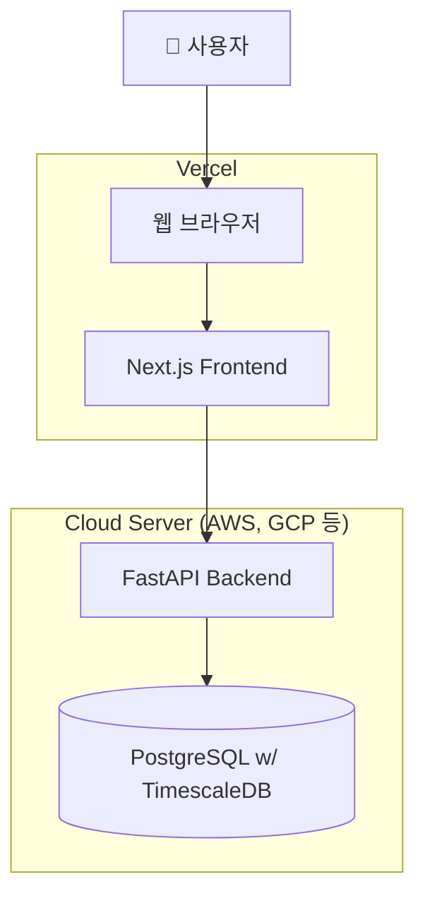

# 🏗️ 03. 아키텍처 (Architecture)

## 1. 시스템 구조도

> 이 다이어그램은 'Project: Cortex'의 전체적인 기술 구성과 데이터 흐름을 시각적으로 나타냅니다.

## 2. 데이터 흐름 및 구성 요소 역할

### 1. 사용자 (User) & 브라우저 (Browser)

- 사용자는 웹 브라우저를 통해 우리 서비스와 상호작용하는 최종 주체입니다.

### 2. 프론트엔드 (Frontend / Vercel)

- 기술: Next.js
- 역할: 사용자에게 보여지는 모든 UI를 렌더링하고, 사용자의 입력을 받아 처리합니다. 데이터가 필요할 경우, 백엔드 서버에 API를 호출하는 역할을 담당합니다.
- 배포: Vercel에 배포하여 글로벌 CDN, 자동 CI/CD, 서버리스 함수 등의 이점을 활용합니다.

### 3. 백엔드 (Backend / Cloud Server)

- 기술: FastAPI (Python)
- 역할: 프론트엔드로부터의 API 요청을 받아 핵심 비즈니스 로직을 수행합니다. 예를 들어, 사용자 인증, 백테스팅 알고리즘 실행, 데이터베이스와의 통신 등을 처리하고 그 결과를 프론트엔드에 반환합니다.
- 배포: Docker 컨테이너로 패키징되어 AWS, GCP, Azure 등 클라우드 서버 환경에서 실행됩니다.

### 4. 데이터베이스 (Database / Cloud Server)

- 기술: PostgreSQL with TimescaleDB extension
- 역할: 프로젝트의 모든 데이터를 영구적으로 저장합니다.
  - PostgreSQL (관계형): 사용자 정보, 저장된 전략, 설정 등 구조화된 데이터를 저장합니다.
  - TimescaleDB (시계열): 백테스팅에 사용될 방대한 양의 OHLCV 가격 데이터를 시간 순서에 따라 효율적으로 저장하고 조회합니다.
