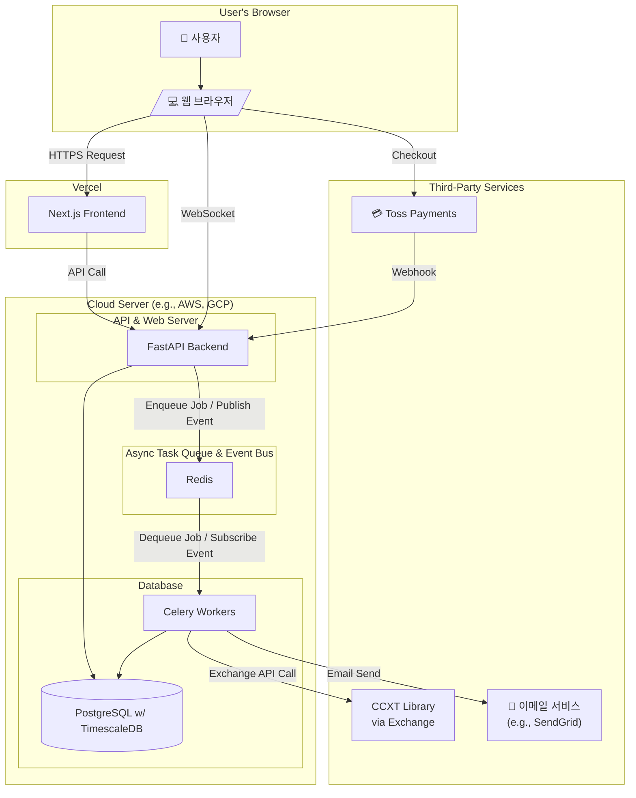

# 🏗️ 03. 아키텍처 (Architecture)

이 문서는 'Project: Cortex'의 전체 시스템 구성과 데이터 흐름, 그리고 각 구성 요소의 역할을 정의합니다.

---

## 1. 시스템 구조도 (System Architecture Diagram)


```mermaid
graph TD
subgraph "User's Browser"
User["👤 사용자"] --> Browser[/"💻 웹 브라우저"/]
end

    subgraph "Vercel"
        Browser -- HTTPS Request --> FE[Next.js Frontend]
    end

    subgraph "Cloud Server (e.g., AWS, GCP)"
        subgraph "API & Web Server"
            FE -- API Call --> BE[FastAPI Backend]
            Browser -- WebSocket --> BE
        end

        subgraph "Database"
            BE --> DB[(PostgreSQL w/ TimescaleDB)]
            Celery[Celery Workers] --> DB
        end

        subgraph "Async Task Queue & Event Bus"
            BE -- Enqueue Job / Publish Event --> Redis[Redis]
            Redis -- Dequeue Job / Subscribe Event --> Celery
        end
    end

    subgraph "Third-Party Services"
        Browser -- Checkout --> PaymentGW["💳 Toss Payments"]
        PaymentGW -- Webhook --> BE
        Celery -- Exchange API Call --> CCXT["CCXT Library<br>via Exchange"]
        Celery -- Email Send --> EmailSvc["📧 이메일 서비스<br>(e.g., SendGrid)"]
    end

```

---

## 2. 구성 요소 역할 및 데이터 흐름

### 2.1. 기본 API 요청 흐름

1.  **사용자 (User):** 브라우저를 통해 프론트엔드(Next.js)와 상호작용합니다.
2.  **프론트엔드 (Next.js on Vercel):** 사용자의 요청에 따라 UI를 렌더링하고, 백엔드(FastAPI)에 API를 호출하여 데이터를 주고받습니다.
3.  **백엔드 (FastAPI on Cloud):** API 요청을 받아 인증, 비즈니스 로직 처리 후 데이터베이스와 통신하여 결과를 프론트엔드에 반환합니다.

### 2.2. 결제 및 이벤트 기반 비동기 처리 흐름

1.  **결제 요청:** 사용자가 프론트엔드에서 '구매하기'(마켓플레이스) 또는 '구독하기' 버튼을 클릭합니다.
2.  **주문 생성 및 결제 준비:** 백엔드는 `MarketplaceOrder`를 `PENDING` 상태로 DB에 생성하고, Toss Payments 결제 위젯에 필요한 정보를 프론트엔드로 전달합니다.
3.  **Webhook 수신:** 결제가 성공하면, **Toss Payments가 백엔드의 `/webhooks/toss-payments` 엔드포인트로 비동기 알림**을 보냅니다.
4.  **이벤트 발행 (Publish):** Webhook 엔드포인트는 `payment.succeeded` 또는 `subscription.recurring_payment.succeeded` 와 같은 명확한 '이벤트'를 Redis(메시지 버스)에 발행하고 즉시 `200 OK`로 응답합니다.
5.  **이벤트 처리 (Consume):** 별도의 Celery 워커(`dispatch_event` 태스크)가 이벤트를 구독하고 있다가, 그에 맞는 후속 작업들(e.g., `fulfill_order_task`, `send_purchase_notification_task`)을 실행하여 **실제 비즈니스 로직(자산 지급, 구독 상태 변경, 이메일 알림 발송 등)을 처리**합니다.
6.  **장점:** 이 구조는 결제 시스템과 핵심 비즈니스 로직의 **결합도를 낮추어(loosely coupled)**, 향후 새로운 후속 조치가 추가되어도 기존 코드를 수정할 필요 없이 새로운 이벤트 구독자만 추가하면 되므로 확장성이 매우 뛰어납니다. 이는 향후 MSA 전환을 위한 핵심 기반이 됩니다.

### 2.3. 비동기 백테스팅 흐름

1.  **Job Enqueue:** 사용자가 백테스팅을 요청하면, FastAPI 서버는 DB에 `Backtest` 객체를 `pending` 상태로 생성하고 **Celery에 작업(`run_backtest`)을 등록(Enqueue)**한 뒤, 사용자에게는 "요청이 접수되었습니다"라고 즉시 응답합니다.
2.  **Job Dequeue & Execution:** 별도의 서버에서 대기하던 **Celery Worker**가 Redis를 통해 작업을 전달받아 실제 백테스팅 시뮬레이션을 실행합니다.
3.  **Execution & Result:** Celery Worker는 시세 데이터를 조회하고, 복잡한 계산을 수행한 뒤, 최종 결과를 데이터베이스에 저장하고 `Backtest` 객체의 상태를 `completed` 또는 `failed`로 업데이트합니다.

### 2.4. 실시간 통신 흐름 (WebSocket)

1.  **Connection:** 사용자가 백테스팅 결과 페이지에 접속하면, 프론트엔드는 `/ws/backtest/{backtest_id}`로 WebSocket 연결을 요청합니다.
2.  **Subscription:** FastAPI 서버는 Redis의 Pub/Sub 채널(`ws:backtest:{backtest_id}`)을 구독합니다.
3.  **Real-time Update:** 백그라운드 Celery 워커에서 실행되는 백테스팅 작업은 진행률이 바뀔 때마다 `WebSocketManager`를 통해 Redis 채널로 상태 메시지를 발행(Publish)합니다.
4.  **Message Push:** FastAPI 서버는 Redis 채널에서 메시지를 수신하는 즉시, 연결된 WebSocket 클라이언트에게 해당 메시지를 실시간으로 전달합니다.

---

## 3. 프로젝트 폴더 구조 (Project Folder Structure)

```text
Cortex/
│
├── .gitignore
├── README.md
├── PROJECT_ROADMAP.md
├── docker-compose.yml
│
├── docs/ # 모든 기획 및 설계 문서 (00~10번)
│
├── backend/ # FastAPI 백엔드 프로젝트 루트
│ ├── .venv/
│ ├── .env
│ ├── main.py
│ ├── requirements.txt
│ ├── app/ # 백엔드 소스코드 폴더
│ ├── routers/ # API 엔드포인트 라우터 (e.g., users.py, marketplace.py)
│ ├── services/ # 비즈니스 로직 (e.g., user_service.py, marketplace_service.py)
│ ├── gateways/ # 외부 서비스 API 클라이언트 (e.g., toss_payments_client.py)
│ ├── models/ # DB 테이블 모델 (SQLAlchemy)
│ ├── templates/ # 이메일 템플릿 (Jinja2)
│ ├── schemas.py # 데이터 유효성 검사 스키마 (Pydantic)
│ ├── dependencies.py # 의존성 주입 (DB 세션, 사용자 인증 등)
│ ├── event_bus.py # 이벤트 발행 로직
│ ├── tasks.py # Celery 백그라운드 작업 정의
│ └── celery_app.py # Celery 앱 설정
│
├── frontend/ # Next.js 프론트엔드 프로젝트 루트
│ ├── .next/
│ ├── node_modules/
│ ├── public/
│ ├── src/ # 핵심 소스 코드
│ │ ├── app/
│ │ │ ├── [locale]/
│ │ │ ├── layout.tsx
│ │ │ ├── page.tsx
│ │ │ └── ... (dashboard/, backtester/, marketplace/ 등 페이지 폴더)
│ │ ├── components/
│ │ │ ├── ui/
│ │ │ ├── layout/
│ │ │ └── domain/
│ │ ├── lib/
│ │ │ ├── apiClient.ts
│ │ │ └── utils.ts
│ │ ├── hooks/
│ │ ├── messages/ # 다국어 지원 텍스트 (en.json, ko.json)
│ │ ├── store/ # Zustand 전역 상태 관리
│ │ └── middleware.ts
│ │
│ ├── i18n.ts
│ ├── .env.local # 프론트엔드 환경 변수
│ ├── next.config.ts # Next.js 메인 설정
│ └── tsconfig.json # TypeScript 설정
```
