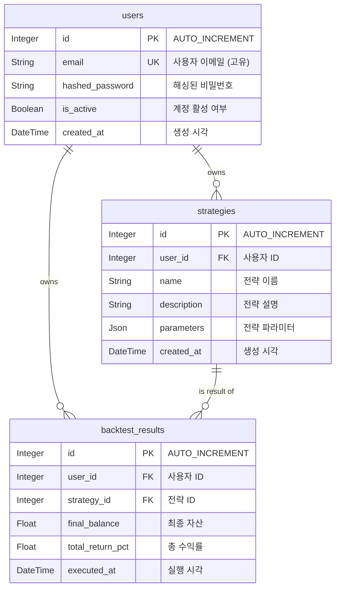

# 💾 07. 데이터베이스 스키마 (Database Schema)

이 문서는 'Project: Cortex'의 데이터베이스 테이블 구조와 관계를 정의합니다.

## 1. ERD (Entity Relationship Diagram)

## 2. 테이블 설명

- `users`: 사용자 계정 정보를 저장하는 테이블입니다.
- `trategies`: 사용자가 생성한 투자 전략의 메타데이터(이름, 설명)와 파라미터(설정값)를 저장합니다.
- `backtest_results`: 각 백테스팅 실행의 요약된 최종 결과를 저장합니다. 상세 거래 로그나 자산 변화 데이터는 별도로 관리될 수 있습니다.

## 3. 시계열 데이터 (TimescaleDB Hypertable)

- **OHLCV (시가, 고가, 저가, 종가, 거래량) 데이터**는 관계형 테이블이 아닌, TimescaleDB의 **하이퍼테이블(Hypertable)**로 관리됩니다.
- 이는 대용량 시계열 데이터의 빠르고 효율적인 입출력을 위해 필수적입니다.
- **예시 테이블명:** `ohlcv_1m`, `ohlcv_1h` 등 타임프레임별로 테이블을 분리하여 관리할 수 있습니다.
- **스키마 예시:**
  - `time` (TIMESTAMPTZ, NOT NULL)
  - `ticker` (TEXT, NOT NULL)
  - `open` (DOUBLE PRECISION)
  - `high` (DOUBLE PRECISION)
  - `low` (DOUBLE PRECISION)
  - `close` (DOUBLE PRECISION)
  - `volume` (DOUBLE PRECISION)
