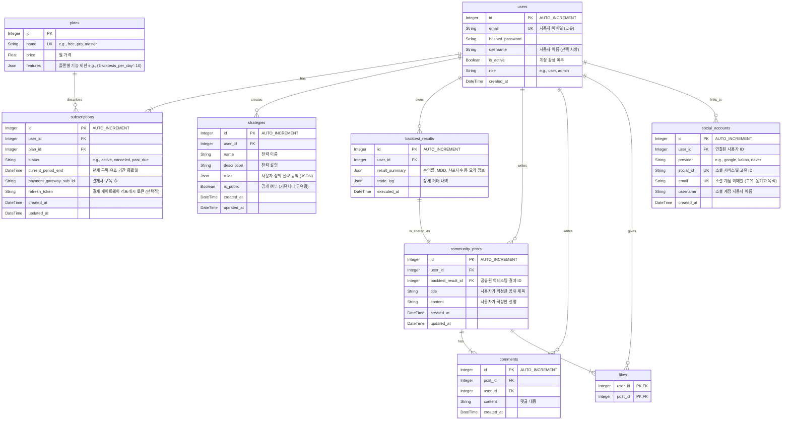

# 💾 07. 데이터베이스 스키마 (Database Schema)

이 문서는 'Project: Cortex'의 모든 데이터를 저장하는 PostgreSQL 데이터베이스의 테이블 구조와 관계를 정의합니다.

## 1. ERD (Entity Relationship Diagram)

## 2. 테이블 설명

- **`users`**: 사용자 계정 정보와 역할을 저장합니다. `schemas.py`에서 `username` 필드가 추가된 것을 반영하여 ERD에도 포함되었습니다.
- **`social_accounts`**: OAuth (Google, Kakao, Naver 등)를 통한 소셜 로그인 계정 정보를 저장하고, 어떤 `users` 테이블의 사용자와 연결되어 있는지 관리합니다. `schemas.py`의 `SocialUserProfile` 스키마에 대응합니다.
- **`plans`**: 구독 플랜(Free, Pro, Master)의 종류와 가격, 기능 제한 정책을 정의합니다.
- **`subscriptions`**: 어떤 사용자가 어떤 플랜을 구독하고 있는지, 구독 상태와 유효 기간을 관리하는 핵심 테이블입니다. `schemas.py`의 `Token` 스키마에 `refresh_token`이 포함된 것을 고려하여 `refresh_token` 필드가 추가되었습니다. `created_at`과 `updated_at` 필드도 추가하여 구독 정보의 변경 이력을 추적할 수 있도록 합니다.
- **`strategies`**: 사용자가 '전략 빌더'를 통해 생성한 자신만의 투자 전략 규칙을 JSON 형태로 저장합니다. `schemas.py`의 `Strategy` 스키마에 `is_public` 필드가 추가된 것을 반영하여 ERD에도 포함되었습니다. `created_at`과 `updated_at` 필드도 추가하여 전략의 생성 및 최종 수정 시점을 추적합니다.
- **`backtest_results`**: 백테스팅 실행 결과를 저장합니다. 커뮤니티 공유를 위해 다른 테이블과 분리합니다.
- **`community_posts`**: 사용자가 자신의 백테스팅 결과를 커뮤니티에 공유할 때 생성되는 게시물 정보입니다. `created_at`과 `updated_at` 필드도 추가하여 게시물의 변경 이력을 추적합니다.
- **`comments`**: 커뮤니티 게시물에 달린 댓글 정보를 저장합니다.
- **`likes`**: 커뮤니티 게시물에 대한 '좋아요' 정보를 저장합니다.

## 3. 시계열 데이터 (TimescaleDB Hypertable)

- **OHLCV (시가, 고가, 저가, 종가, 거래량) 데이터**는 관계형 테이블이 아닌, TimescaleDB의 **하이퍼테이블(Hypertable)**로 관리됩니다.
- 이는 대용량 시계열 데이터의 빠르고 효율적인 입출력을 위해 필수적입니다.
- **스키마 예시 (`ohlcv_1h` 테이블):**
  - `time` (TIMESTAMPTZ, NOT NULL)
  - `ticker` (TEXT, NOT NULL)
  - `open` (DOUBLE PRECISION)
  - `high` (DOUBLE PRECISION)
  - `low` (DOUBLE PRECISION)
  - `close` (DOUBLE PRECISION)
  - `volume` (DOUBLE PRECISION)
