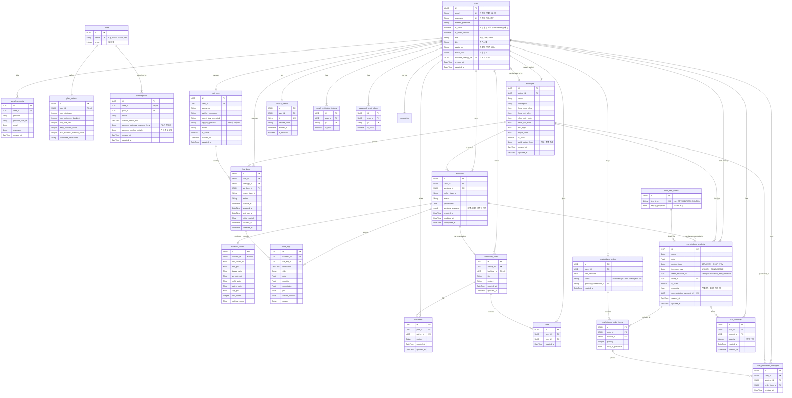

# 💾 07. 데이터베이스 스키마 (Database Schema)

이 문서는 'Project: Cortex'의 모든 데이터를 저장하는 PostgreSQL 데이터베이스의 테이블 구조와 관계를 정의합니다.

---

## 1. ERD (Entity Relationship Diagram)

```mermaid
erDiagram
users {
UUID id PK
String email UK "사용자 이메일 (고유)"
String username UK "사용자 이름 (고유)"
String hashed_password
Boolean is_active "계정 활성 여부 (Soft Delete 플래그)"
Boolean is_email_verified
String role "e.g., user, admin"
String bio "자기소개"
String avatar_url "프로필 이미지 URL"
Jsonb social_links "소셜 링크"
UUID featured_strategy_id FK "대표 전략 ID"
DateTime created_at
DateTime updated_at
}

    social_accounts {
        UUID id PK
        UUID user_id FK
        String provider
        String provider_user_id
        String email
        String username
        DateTime created_at
        %% Unique(provider, provider_user_id)
    }

    plans {
        UUID id PK
        String name UK "e.g., Basic, Trader, Pro"
        Integer price "월 가격"
    }

    plan_features {
        UUID id PK
        UUID plan_id FK,UK
        Integer max_strategies
        Integer max_coins_per_backtest
        Integer live_bots_limit
        Integer daily_backtest_count
        Integer max_backtest_duration_years
        String supported_timeframes
    }

    subscriptions {
        UUID id PK
        UUID user_id FK,UK
        UUID plan_id FK
        String status
        DateTime current_period_end
        String payment_gateway_customer_key "PG사 빌링키"
        String payment_method_details "카드 정보 요약"
        DateTime created_at
        DateTime updated_at
    }

    strategies {
        UUID id PK
        UUID author_id FK
        String name
        String description
        Json long_entry_rules
        Json long_exit_rules
        Json short_entry_rules
        Json short_exit_rules
        Json tpsl_logic
        Json target_coins
        Boolean is_public
        String paid_feature_level "필요 플랜 등급"
        DateTime created_at
        DateTime updated_at
    }

    backtests {
        UUID id PK
        UUID user_id FK
        UUID strategy_id FK
        String celery_task_id
        String status
        Json parameters
        Jsonb strategy_snapshot "실행 시점의 전략 복사본"
        DateTime created_at
        DateTime updated_at
        DateTime completed_at
    }

    backtest_results {
        UUID id PK
        UUID backtest_id FK,UK
        Float total_return_pct
        Float mdd_pct
        Float sharpe_ratio
        Float win_rate_pct
        Float profit_factor
        Float sortino_ratio
        Float cagr_pct
        Integer total_trades
        Float backtest_score
    }

    trade_logs {
        UUID id PK
        UUID backtest_id FK
        UUID live_bot_id FK
        DateTime timestamp
        String side
        Float price
        Float quantity
        Float commission
        Float pnl
        Float current_balance
        String reason
        %% Check(backtest_id or live_bot_id)
    }

    api_keys {
        UUID id PK
        UUID user_id FK
        String exchange
        String api_key_encrypted
        String secret_key_encrypted
        String api_key_preview "API 키 미리보기"
        String memo
        Boolean is_active
        DateTime created_at
        DateTime updated_at
        %% Unique(user_id, exchange)
    }

    live_bots {
        UUID id PK
        UUID user_id FK
        UUID strategy_id FK
        UUID api_key_id FK
        String celery_task_id
        String status
        DateTime started_at
        DateTime stopped_at
        DateTime last_run_at
        Float initial_capital
        DateTime created_at
        DateTime updated_at
    }

    community_posts {
        UUID id PK
        UUID author_id FK
        UUID backtest_id FK,UK
        String title
        String content
        DateTime created_at
        DateTime updated_at
    }

    comments {
        UUID id PK
        UUID post_id FK
        UUID author_id FK
        String content
        DateTime created_at
        DateTime updated_at
    }

    likes {
        UUID id PK
        UUID user_id FK
        UUID post_id FK
        DateTime created_at
        %% Unique(user_id, post_id)
    }

    refresh_tokens {
        UUID id PK
        UUID user_id FK
        String jti UK
        String hashed_token
        DateTime expires_at
        Boolean is_revoked
    }

    email_verification_tokens {
        UUID id PK
        UUID user_id FK
        String jti UK
        Boolean is_used
    }

    password_reset_tokens {
        UUID id PK
        UUID user_id FK
        String jti UK
        Boolean is_used
    }

    shop_item_details {
        UUID id PK
        String item_type UK "e.g., OPTIMIZATION_COUPON"
        Json display_properties "UI 표시 속성"
    }

    marketplace_products {
        UUID id PK
        String name
        Float price
        String product_type "STRATEGY | SHOP_ITEM"
        String inventory_type "UNLOCK | CONSUMABLE"
        UUID linked_resource_id "strategies.id or shop_item_details.id"
        UUID seller_id FK
        Boolean is_active
        Json metadata "카테고리, 포지션 타입 등"
        UUID representative_backtest_id FK
        DateTime created_at
        DateTime updated_at
    }

    marketplace_orders {
        UUID id PK
        UUID buyer_id FK
        Float total_amount
        String status "PENDING | COMPLETED | FAILED"
        String gateway_transaction_id UK
        DateTime created_at
    }

    marketplace_order_items {
        UUID id PK
        UUID order_id FK
        UUID product_id FK
        Integer quantity
        Float price_at_purchase
    }

    user_purchased_strategies {
        UUID id PK
        UUID user_id FK
        UUID strategy_id FK
        UUID order_item_id FK
        DateTime created_at
        %% Unique(user_id, strategy_id)
    }

    user_inventory {
        UUID id PK
        UUID user_id FK
        UUID product_id FK
        Integer quantity "보유 수량"
        DateTime created_at
        DateTime updated_at
        %% Unique(user_id, product_id)
    }

    users ||--o{ social_accounts : links
    users ||--o| subscription : "has one"
    users ||--|{ strategies : "creates (author)"
    users ||--|{ backtests : runs
    users ||--|{ api_keys : manages
    users ||--|{ live_bots : operates
    users ||--|{ community_posts : writes
    users ||--|{ comments : writes
    users ||--|{ likes : gives
    users ||--|{ refresh_tokens : has
    users ||--|{ email_verification_tokens : "has"
    users ||--|{ password_reset_tokens : "has"
    users ||--|{ marketplace_products : "sells (seller)"
    users ||--o{ marketplace_orders : buys
    users ||--o{ user_purchased_strategies : owns
    users ||--o{ user_inventory : has

    plans ||--|| plan_features : "defines"
    plans ||--|{ subscriptions : "subscribed by"

    strategies ||--|{ backtests : "is used in"
    strategies ||--|{ live_bots : powers
    strategies ||--o{ user_purchased_strategies : purchased_as
    strategies ||--o{ marketplace_products : listed_as
    strategies ||--o| users : "can be featured by"

    backtests ||--|| backtest_results : "produces"
    backtests ||--|{ trade_logs : records
    backtests ||--o| community_posts : "can be shared as"
    backtests ||--o{ marketplace_products : "can be representative for"

    api_keys ||--|{ live_bots : "used by"
    live_bots ||--|{ trade_logs : records

    community_posts ||--|{ comments : has
    community_posts ||--|{ likes : receives

    marketplace_products ||--|{ marketplace_order_items : included_in
    marketplace_products ||--o{ user_inventory : holds

    shop_item_details ||--o{ marketplace_products : details_for

    marketplace_orders ||--|{ marketplace_order_items : contains

    marketplace_order_items ||--o{ user_purchased_strategies : grants

```

---

## 2. 테이블 설명 및 데이터 정책

- **`users`**: 사용자 계정, 프로필 정보.
  - **데이터 정책 (Soft Delete):** 사용자 탈퇴 시, 계정은 물리적으로 삭제되지 않습니다. 대신 `is_active`를 `False`로 변경하고, 개인 식별 정보(이메일, 사용자명)를 익명화 처리합니다(Soft Delete).
- **`social_accounts`**: OAuth 소셜 로그인 계정 정보.
- **`plans`**: 구독 플랜(Basic, Trader, Pro)의 종류와 가격 정의.
- **`plan_features`**: 각 플랜별 상세 기능 제한(최대 전략 수, 봇 개수 등) 관리.
- **`subscriptions`**: 사용자의 구독 상태와 유효 기간 관리.
- **`strategies`**: 사용자가 생성한 투자 전략 규칙(롱/숏 진입/청산, TP/SL 등)을 JSON 필드로 저장.
- **`backtests`**: 백테스팅 실행 요청 및 상태 기록.
  - **`strategy_snapshot` (Jsonb)**: 백테스팅 실행 시점의 전략 설정 전체를 JSON 형태로 복사하여 저장합니다. 이를 통해 **원본 전략이 수정되거나 삭제되어도 과거의 백테스트 결과는 원본 그대로 보존**됩니다.
- **`backtest_results`**: 백테스팅 실행의 모든 상세 성과 지표(수익률, MDD, 승률, 샤프 지수 등) 저장.
- **`trade_logs`**: 백테스팅 또는 자동매매의 개별 거래 기록. `backtest_id` 또는 `live_bot_id` 중 하나만 가집니다.
- **`api_keys`**: 사용자의 거래소 API 키를 암호화하여 저장.
- **`live_bots`**: 자동매매 봇 인스턴스의 상태 관리.
- **`community_posts`**: 사용자가 백테스팅 결과를 커뮤니티에 공유할 때 생성되는 게시물.
- **`comments`**, **`likes`**: 커뮤니티 게시물에 대한 댓글 및 '좋아요' 정보.
- **`shop_item_details`**: 상점 아이템(e.g., 최적화 쿠폰)의 고유 속성(UI 표시 정보 등) 정의.
- **`marketplace_products`**: 판매되는 모든 상품(전략, 상점 아이템)의 공통 정보 통합 관리.
- **`marketplace_orders`**: 사용자의 결제 요청 단위인 '주문' 정보 저장.
- **`marketplace_order_items`**: 주문에 포함된 개별 상품 항목 저장.
- **`user_purchased_strategies`**: 사용자가 구매한 '전략 소유권' 정보 저장. (Unlock 타입)
- **`user_inventory`**: 사용자가 보유한 '소모성 아이템'의 수량 관리. (Consumable 타입)
- **`refresh_tokens`**, `email_verification_tokens`, `password_reset_tokens` : JWT 리프레시, 이메일 인증, 비밀번호 재설정을 위한 일회성 토큰 정보들을 안전하게 관리.

---

## 3. 시계열 데이터 (TimescaleDB Hypertable)

- **OHLCV (시가, 고가, 저가, 종가, 거래량) 데이터**는 TimescaleDB의 **하이퍼테이블(Hypertable)**로 관리됩니다.
- **테이블 예시**: `ohlcv_1h`, `ohlcv_4h`, `ohlcv_1d` 등 타임프레임별로 생성됩니다.
- **공통 스키마 (`ohlcv_{timeframe}`):**
  - `time` (TIMESTAMPTZ, PK)
  - `ticker` (TEXT, PK)
  - `open`, `high`, `low`, `close`, `volume` (DOUBLE PRECISION)
- **인덱싱**: 빠른 조회를 위해 `(ticker, time DESC)` 복합 인덱스가 각 테이블에 적용됩니다.
