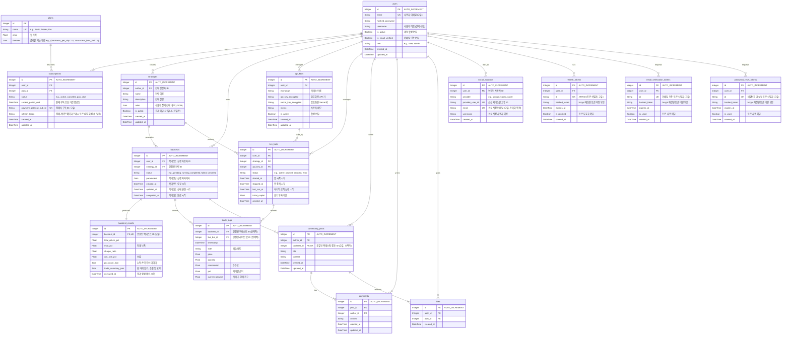

# 💾 07. 데이터베이스 스키마 (Database Schema)

이 문서는 'Project: Cortex'의 모든 데이터를 저장하는 PostgreSQL 데이터베이스의 테이블 구조와 관계를 정의합니다.

## 1. ERD (Entity Relationship Diagram)

```mermaid
erDiagram
    users {
        Integer id PK "AUTO_INCREMENT"
        String email UK "사용자 이메일 (고유)"
        String hashed_password
        String username "사용자 이름 (선택 사항)"
        Boolean is_active "계정 활성 여부"
        Boolean is_email_verified "이메일 인증 여부"
        String role "e.g., user, admin"
        DateTime created_at
        DateTime updated_at
    }

    social_accounts {
        Integer id PK "AUTO_INCREMENT"
        Integer user_id FK "연결된 사용자 ID"
        String provider "e.g., google, kakao, naver"
        String provider_user_id UK "소셜 서비스별 고유 ID"
        String email UK "소셜 계정 이메일 (고유, 동기화 목적)"
        String username "소셜 계정 사용자 이름"
        DateTime created_at
    }

    plans {
        Integer id PK
        String name UK "e.g., Basic, Trader, Pro"
        Float price "월 가격"
        Json features "플랜별 기능 제한 e.g., {'backtests_per_day': 10, 'concurrent_bots_limit': 5}"
    }

    subscriptions {
        Integer id PK "AUTO_INCREMENT"
        Integer user_id FK
        Integer plan_id FK
        String status "e.g., active, canceled, past_due"
        DateTime current_period_end "현재 구독 유효 기간 종료일"
        String payment_gateway_sub_id UK "결제사 구독 ID (고유)"
        String refresh_token "결제 게이트웨이 리프레시 토큰 (암호화될 수 있음)"
        DateTime created_at
        DateTime updated_at
    }

    strategies {
        Integer id PK "AUTO_INCREMENT"
        Integer author_id FK "전략 생성자 ID"
        String name "전략 이름"
        String description "전략 설명"
        Json rules "사용자 정의 전략 규칙 (JSON)"
        Boolean is_public "공개 여부 (커뮤니티 공유용)"
        DateTime created_at
        DateTime updated_at
    }

    backtests {
        Integer id PK "AUTO_INCREMENT"
        Integer user_id FK "백테스트 실행 사용자 ID"
        Integer strategy_id FK "연결된 전략 ID"
        String status "e.g., pending, running, completed, failed, canceled"
        Json parameters "백테스팅 실행 파라미터"
        DateTime created_at "백테스트 요청 시각"
        DateTime updated_at "백테스트 상태 변경 시각"
        DateTime completed_at "백테스트 완료 시각"
    }

    backtest_results {
        Integer id PK "AUTO_INCREMENT"
        Integer backtest_id FK,UK "연결된 백테스트 ID (고유)"
        Float total_return_pct
        Float mdd_pct "최대 낙폭"
        Float sharpe_ratio
        Float win_rate_pct "승률"
        Json pnl_curve_json "누적 손익 곡선 데이터"
        Json trade_summary_json "총 거래 횟수, 승률 등 요약"
        DateTime executed_at "결과 생성/계산 시각"
    }

    trade_logs {
        Integer id PK "AUTO_INCREMENT"
        Integer backtest_id FK "연결된 백테스트 ID (선택적)"
        Integer live_bot_id FK "연결된 라이브 봇 ID (선택적)"
        DateTime timestamp
        String side "매수/매도"
        Float price
        Float quantity
        Float commission "수수료"
        Float pnl "거래별 손익"
        Float current_balance "거래 후 현재 잔고"
    }

    api_keys {
        Integer id PK "AUTO_INCREMENT"
        Integer user_id FK
        String exchange "거래소 이름"
        String api_key_encrypted "암호화된 API 키"
        String secret_key_encrypted "암호화된 Secret 키"
        String memo "사용자 메모"
        Boolean is_active "활성 여부"
        DateTime created_at
        DateTime updated_at
    }

    live_bots {
        Integer id PK "AUTO_INCREMENT"
        Integer user_id FK
        Integer strategy_id FK
        Integer api_key_id FK
        String status "e.g., active, paused, stopped, error"
        DateTime started_at "봇 시작 시각"
        DateTime stopped_at "봇 중지 시각"
        DateTime last_run_at "마지막 로직 실행 시각"
        Float initial_capital "초기 투자 자본"
        DateTime created_at
    }

    community_posts {
        Integer id PK "AUTO_INCREMENT"
        Integer author_id FK
        Integer backtest_id FK,UK "공유된 백테스팅 결과 ID (고유, 선택적)"
        String title
        String content
        DateTime created_at
        DateTime updated_at
    }

    comments {
        Integer id PK "AUTO_INCREMENT"
        Integer post_id FK
        Integer author_id FK
        String content
        DateTime created_at
        DateTime updated_at
    }

    likes {
        Integer id PK "AUTO_INCREMENT"
        Integer user_id FK
        Integer post_id FK
        DateTime created_at
    }

    refresh_tokens {
        Integer id PK "AUTO_INCREMENT"
        Integer user_id FK
        String jti UK "JWT ID (토큰 식별자, 고유)"
        String hashed_token "bcrypt 해싱된 토큰 비밀 부분"
        DateTime expires_at
        Boolean is_revoked "토큰 무효화 여부"
        DateTime created_at
    }

    email_verification_tokens {
        Integer id PK "AUTO_INCREMENT"
        Integer user_id FK
        String jti UK "이메일 인증 토큰 식별자 (고유)"
        String hashed_token "bcrypt 해싱된 토큰 비밀 부분"
        DateTime expires_at
        Boolean is_used "토큰 사용 여부"
        DateTime created_at
    }

    password_reset_tokens {
        Integer id PK "AUTO_INCREMENT"
        Integer user_id FK
        String jti UK "비밀번호 재설정 토큰 식별자 (고유)"
        String hashed_token "bcrypt 해싱된 토큰 비밀 부분"
        DateTime expires_at
        Boolean is_used "토큰 사용 여부"
        DateTime created_at
    }


    users ||--|{ subscriptions : "has"
    users ||--o{ strategies : "creates"
    users ||--o{ backtests : "owns"
    users ||--o{ api_keys : "manages"
    users ||--o{ live_bots : "manages"
    users ||--o{ community_posts : "writes"
    users ||--o{ comments : "writes"
    users ||--o{ likes : "gives"
    users ||--o{ social_accounts : "links_to"
    users ||--o{ refresh_tokens : "has"
    users ||--o{ email_verification_tokens : "requests"
    users ||--o{ password_reset_tokens : "requests"

    plans ||--o{ subscriptions : "describes"

    strategies ||--o{ backtests : "generates"
    strategies ||--o{ live_bots : "powers"

    backtests ||--|| backtest_results : "produces"
    backtests ||--o{ trade_logs : "records"
    backtests ||--o{ community_posts : "is_shared_as"

    api_keys ||--o{ live_bots : "used_by"

    live_bots ||--o{ trade_logs : "records"

    community_posts ||--|{ comments : "has"
    community_posts ||--|{ likes : "receives"
```

## 2. 테이블 설명

- **`users`**: 사용자 계정 정보와 역할을 저장합니다. `is_email_verified` 필드가 추가되었습니다.
- **`social_accounts`**: OAuth (Google, Kakao, Naver 등)를 통한 소셜 로그인 계정 정보를 저장하고, 어떤 `users` 테이블의 사용자와 연결되어 있는지 관리합니다. `email`과 `username` 필드가 포함됩니다.
- **`plans`**: 구독 플랜(Basic, Trader, Pro)의 종류와 가격, 기능 제한 정책(`features` JSON)을 정의합니다.
- **`subscriptions`**: 어떤 사용자가 어떤 플랜을 구독하고 있는지, 구독 상태와 유효 기간을 관리하는 핵심 테이블입니다. `payment_gateway_sub_id`와 `refresh_token`이 결제 게이트웨이 연동을 위해 포함됩니다.
- **`strategies`**: 사용자가 '전략 빌더'를 통해 생성한 자신만의 투자 전략 규칙을 JSON 형태로 저장합니다. `is_public` 필드를 통해 커뮤니티 공유 여부를 설정합니다. `Backtest` 및 `LiveBot`과의 관계가 추가되었습니다.
- **`backtests`**: 백테스팅 실행 기록을 저장합니다. `status`, `parameters`, `created_at`, `updated_at`, `completed_at` 필드를 통해 실행 상태 및 이력을 추적합니다. `strategy` 관계가 추가되었습니다.
- **`backtest_results`**: 백테스팅 실행의 상세 결과(수익률, MDD 등 요약 정보)와 `pnl_curve_json`, `trade_summary_json`을 저장합니다.
- **`trade_logs`**: 백테스팅 또는 자동매매의 개별 거래 기록을 저장합니다. `backtest_id`와 `live_bot_id` 중 하나만 존재하는 `CheckConstraint`가 적용됩니다. `commission`과 `current_balance` 필드가 추가됩니다.
- **`api_keys`**: 사용자의 암호화폐 거래소 API 키(암호화된 형태로)를 저장합니다. `memo` 필드와 `is_active` 필드를 포함합니다. `LiveBot`과의 관계가 추가되었습니다.
- **`live_bots`**: 자동매매 봇 인스턴스 정보를 저장합니다. `status`, `started_at`, `stopped_at`, `last_run_at`, `initial_capital`, `created_at` 필드를 통해 봇의 생명주기와 상태를 추적합니다. `strategy` 및 `api_key`와의 관계가 추가되었습니다.
- **`community_posts`**: 사용자가 자신의 백테스팅 결과를 커뮤니티에 공유할 때 생성되는 게시물 정보입니다. `backtest_id`는 고유하고 선택적입니다.
- **`comments`**: 커뮤니티 게시물에 달린 댓글 정보를 저장합니다.
- **`likes`**: 커뮤니티 게시물에 대한 '좋아요' 정보를 저장합니다. `id` 필드가 추가되었습니다.
- **`refresh_tokens`**: JWT 리프레시 토큰 관리용 모델입니다. `jti`(JWT ID)와 `hashed_token`을 사용하여 보안성을 높입니다.
- **`email_verification_tokens`**: 이메일 주소 확인(인증)을 위한 일회성 토큰 정보를 저장합니다. `jti`, `hashed_token`, `expires_at`, `is_used` 필드를 포함합니다.
- **`password_reset_tokens`**: 비밀번호 재설정을 위한 일회성 토큰 정보를 저장합니다. `jti`, `hashed_token`, `expires_at`, `is_used` 필드를 포함합니다.

## 3. 시계열 데이터 (TimescaleDB Hypertable)

- **OHLCV (시가, 고가, 저가, 종가, 거래량) 데이터**는 관계형 테이블이 아닌, TimescaleDB의 **하이퍼테이블(Hypertable)**로 관리됩니다.
- 이는 대용량 시계열 데이터의 빠르고 효율적인 입출력을 위해 필수적입니다.
- **스키마 예시 (`ohlcv_1h` 테이블):**
  - `time` (TIMESTAMPTZ, NOT NULL)
  - `ticker` (TEXT, NOT NULL)
  - `open` (DOUBLE PRECISION)
  - `high` (DOUBLE PRECISION)
  - `low` (DOUBLE PRECISION)
  - `close` (DOUBLE PRECISION)
  - `volume` (DOUBLE PRECISION)
