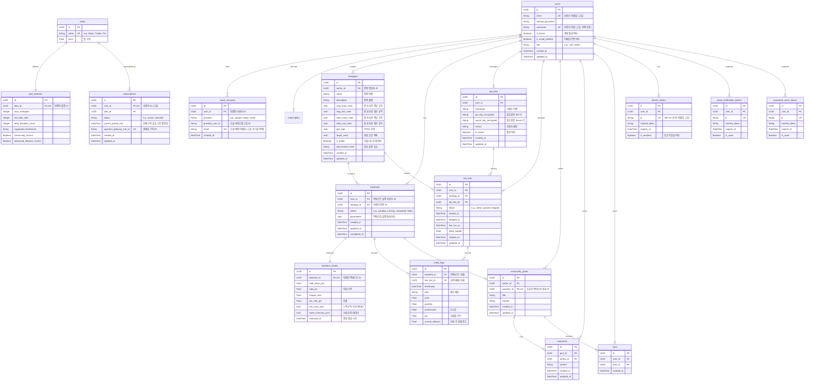

# 💾 07. 데이터베이스 스키마 (Database Schema)

이 문서는 'Project: Cortex'의 모든 데이터를 저장하는 PostgreSQL 데이터베이스의 테이블 구조와 관계를 정의합니다.

## 1. ERD (Entity Relationship Diagram)

```mermaid
erDiagram
    users {
        UUID id PK
        String email UK "사용자 이메일 (고유)"
        String hashed_password
        String username UK "사용자 이름 (고유, 선택 사항)"
        Boolean is_active "계정 활성 여부"
        Boolean is_email_verified "이메일 인증 여부"
        String role "e.g., user, admin"
        DateTime created_at
        DateTime updated_at
    }

    social_accounts {
        UUID id PK
        UUID user_id FK "연결된 사용자 ID"
        String provider "e.g., google, kakao, naver"
        String provider_user_id "소셜 서비스별 고유 ID"
        String email UK "소셜 계정 이메일 (고유, 동기화 목적)"
        DateTime created_at
        %% UniqueConstraint(provider, provider_user_id)
    }

    plans {
        UUID id PK
        String name UK "e.g., Basic, Trader, Pro"
        Float price "월 가격"
    }

    plan_features {
        UUID id PK
        UUID plan_id FK,UK "연결된 플랜 ID"
        Integer max_strategies
        Integer live_bots_limit
        Integer daily_backtest_count
        String supported_timeframes
        Boolean community_access
        Boolean advanced_features_access
    }

    subscriptions {
        UUID id PK
        UUID user_id FK,UK "사용자 ID (고유)"
        UUID plan_id FK
        String status "e.g., active, canceled"
        DateTime current_period_end "현재 구독 유효 기간 종료일"
        String payment_gateway_sub_id UK "결제사 구독 ID"
        DateTime created_at
        DateTime updated_at
    }

    strategies {
        UUID id PK
        UUID author_id FK "전략 생성자 ID"
        String name "전략 이름"
        String description "전략 설명"
        Json long_entry_rules "롱 포지션 진입 규칙"
        Json long_exit_rules "롱 포지션 청산 규칙"
        Json short_entry_rules "숏 포지션 진입 규칙"
        Json short_exit_rules "숏 포지션 청산 규칙"
        Json tpsl_logic "TP/SL 규칙"
        Json target_coins "대상 코인 목록"
        Boolean is_public "커뮤니티 공개 여부"
        String paid_feature_level "필요 플랜 등급"
        DateTime created_at
        DateTime updated_at
    }

    backtests {
        UUID id PK
        UUID user_id FK "백테스트 실행 사용자 ID"
        UUID strategy_id FK "연결된 전략 ID"
        String status "e.g., pending, running, completed, failed"
        Json parameters "백테스팅 실행 파라미터"
        DateTime created_at
        DateTime updated_at
        DateTime completed_at
    }

    backtest_results {
        UUID id PK
        UUID backtest_id FK,UK "연결된 백테스트 ID"
        Float total_return_pct
        Float mdd_pct "최대 낙폭"
        Float sharpe_ratio
        Float win_rate_pct "승률"
        Json pnl_curve_json "누적 손익 곡선 데이터"
        Json trade_summary_json "거래 요약 데이터"
        DateTime executed_at "결과 생성 시각"
    }

    trade_logs {
        UUID id PK
        UUID backtest_id FK "(백테스트 거래)"
        UUID live_bot_id FK "(자동매매 거래)"
        DateTime timestamp
        String side "매수/매도"
        Float price
        Float quantity
        Float commission "수수료"
        Float pnl "거래별 손익"
        Float current_balance "거래 후 현재 잔고"
        %% CheckConstraint: backtest_id와 live_bot_id는 둘 중 하나만 존재해야 함
    }

    api_keys {
        UUID id PK
        UUID user_id FK
        String exchange "거래소 이름"
        String api_key_encrypted "암호화된 API 키"
        String secret_key_encrypted "암호화된 Secret 키"
        String memo "사용자 메모"
        Boolean is_active "활성 여부"
        DateTime created_at
        DateTime updated_at
        %% UniqueConstraint(user_id, exchange)
    }

    live_bots {
        UUID id PK
        UUID user_id FK
        UUID strategy_id FK
        UUID api_key_id FK
        String status "e.g., active, paused, stopped"
        DateTime started_at
        DateTime stopped_at
        DateTime last_run_at
        Float initial_capital
        DateTime created_at
        DateTime updated_at
    }

    community_posts {
        UUID id PK
        UUID author_id FK
        UUID backtest_id FK,UK "공유된 백테스팅 결과 ID"
        String title
        String content
        DateTime created_at
        DateTime updated_at
    }

    comments {
        UUID id PK
        UUID post_id FK
        UUID author_id FK
        String content
        DateTime created_at
        DateTime updated_at
    }

    likes {
        UUID id PK
        UUID user_id FK
        UUID post_id FK
        DateTime created_at
        %% UniqueConstraint(user_id, post_id)
    }

    refresh_tokens {
        UUID id PK
        UUID user_id FK
        String jti UK "JWT ID (토큰 식별자, 고유)"
        String hashed_token
        DateTime expires_at
        Boolean is_revoked "토큰 무효화 여부"
    }

    email_verification_tokens {
        UUID id PK
        UUID user_id FK
        String jti UK
        String hashed_token
        DateTime expires_at
        Boolean is_used
    }

    password_reset_tokens {
        UUID id PK
        UUID user_id FK
        String jti UK
        String hashed_token
        DateTime expires_at
        Boolean is_used
    }

    users ||--o{ social_accounts : "links"
    users ||--o| subscription : "has one"
    users ||--|{ strategies : "creates"
    users ||--|{ backtests : "runs"
    users ||--|{ api_keys : "manages"
    users ||--|{ live_bots : "operates"
    users ||--|{ community_posts : "writes"
    users ||--|{ comments : "writes"
    users ||--|{ likes : "gives"
    users ||--|{ refresh_tokens : "has"
    users ||--|{ email_verification_tokens : "requests"
    users ||--|{ password_reset_tokens : "requests"

    plans ||--|| plan_features : "defines"
    plans ||--|{ subscriptions : "subscribed by"

    strategies ||--|{ backtests : "is used in"
    strategies ||--|{ live_bots : "powers"

    backtests ||--|| backtest_results : "produces"
    backtests ||--|{ trade_logs : "records"
    backtests ||--o| community_posts : "can be shared as"

    api_keys ||--|{ live_bots : "used by"

    live_bots ||--|{ trade_logs : "records"

    community_posts ||--|{ comments : "has"
    community_posts ||--|{ likes : "receives"
```

## 2. 테이블 설명

- **`users`**: 사용자 계정 정보.
- **`social_accounts`**: OAuth 소셜 로그인 계정 정보.
- **`plans`**: 구독 플랜(Basic, Trader, Pro)의 종류와 가격을 정의합니다.
- **`plan_features`**: **(신규)** 각 플랜별 상세 기능 제한(최대 전략 수, 봇 개수 등)을 정규화하여 관리합니다.
- **`subscriptions`**: 사용자의 구독 상태와 유효 기간을 관리합니다. `user_id`가 고유(unique)하여 사용자와 1:1 관계를 가집니다.
- **`strategies`**: 사용자가 생성한 투자 전략 규칙을 목적(롱/숏, 진입/청산)에 따라 세분화된 JSON 필드로 저장합니다.
- **`backtests`**: 백테스팅 실행 요청 및 상태를 기록합니다.
- **`backtest_results`**: 백테스팅 실행의 상세 결과(수익률, MDD 등)를 저장합니다.
- **`trade_logs`**: 백테스팅 또는 자동매매의 개별 거래 기록을 저장합니다. `backtest_id`와 `live_bot_id` 중 하나만 값을 가질 수 있습니다 (CheckConstraint 적용).
- **`api_keys`**: 사용자의 거래소 API 키를 암호화하여 저장합니다.
- **`live_bots`**: 자동매매 봇 인스턴스의 상태와 생명주기를 관리합니다.
- **`community_posts`**: 사용자가 백테스팅 결과를 커뮤니티에 공유할 때 생성되는 게시물 정보입니다.
- **`comments`**: 커뮤니티 게시물에 대한 댓글 정보.
- **`likes`**: 커뮤니티 게시물에 대한 '좋아요' 정보.
- **`refresh_tokens`**, **`email_verification_tokens`**, **`password_reset_tokens`**: 각각 JWT 리프레시, 이메일 인증, 비밀번호 재설정을 위한 일회성 토큰 정보를 안전하게 관리합니다.

## 3. 시계열 데이터 (TimescaleDB Hypertable)

- **OHLCV (시가, 고가, 저가, 종가, 거래량) 데이터**는 대용량 시계열 데이터의 효율적인 처리를 위해 TimescaleDB의 **하이퍼테이블(Hypertable)**로 관리됩니다.
- 아래 타임프레임별로 각각의 하이퍼테이블이 생성됩니다.
  - **생성되는 테이블**: `ohlcv_1m`, `ohlcv_5m`, `ohlcv_15m`, `ohlcv_30m`, `ohlcv_1h`, `ohlcv_4h`, `ohlcv_1d`, `ohlcv_1w`, `ohlcv_1M`
- **공통 스키마 예시 (`ohlcv_{timeframe}` 테이블):**
  - `time` (TIMESTAMPTZ, PK)
  - `ticker` (TEXT, PK)
  - `open` (DOUBLE PRECISION)
  - `high` (DOUBLE PRECISION)
  - `low` (DOUBLE PRECISION)
  - `close` (DOUBLE PRECISION)
  - `volume` (DOUBLE PRECISION)
- **인덱싱**: 빠른 조회를 위해 `(ticker, time DESC)` 복합 인덱스가 각 테이블에 적용됩니다.
