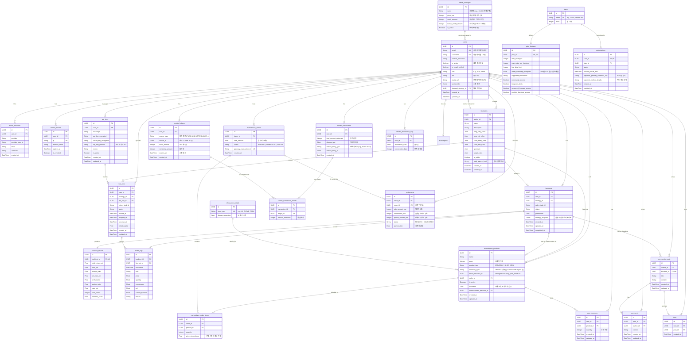

# 💾 07. 데이터베이스 스키마 (Database Schema)

이 문서는 'Project: Cortex'의 모든 데이터를 저장하는 PostgreSQL 데이터베이스의 테이블 구조와 관계를 정의합니다.

---

## 1. ERD (Entity Relationship Diagram)

```mermaid
erDiagram
    %% --- 1. 사용자, 인증, 구독 ---
    users {
        UUID id PK
        String email UK "사용자 이메일 (고유)"
        String username UK "사용자 이름 (고유)"
        String hashed_password
        Boolean is_active "계정 활성 여부"
        Boolean is_email_verified
        String role "e.g., user, admin"
        String bio "자기소개"
        String avatar_url "프로필 이미지 URL"
        Jsonb social_links "소셜 링크"
        UUID featured_strategy_id FK "대표 전략 ID"
        DateTime created_at
        DateTime updated_at
    }
    social_accounts {
        UUID id PK
        UUID user_id FK
        String provider
        String provider_user_id
        String email
        String username
        DateTime created_at
        %% Unique(provider, provider_user_id)
    }
    plans {
        UUID id PK
        String name UK "e.g., Basic, Trader, Pro"
        Integer price "월 가격"
    }
    plan_features {
        UUID id PK
        UUID plan_id FK,UK
        Integer max_strategies
        Integer max_coins_per_backtest
        Integer live_bots_limit
        Float credit_surcharge_multiplier "크레딧 소모 할증/할인 배율"
        String supported_timeframes
        Boolean community_access
        Boolean telegram_alerts
        Boolean advanced_features_access
        Boolean portfolio_backtest_access
    }
    subscriptions {
        UUID id PK
        UUID user_id FK,UK
        UUID plan_id FK
        String status
        DateTime current_period_end
        String payment_gateway_customer_key "PG사 빌링키"
        String payment_method_details "카드 정보 요약"
        DateTime created_at
        DateTime updated_at
    }
    refresh_tokens {
        UUID id PK
        UUID user_id FK
        String jti UK
        String hashed_token
        DateTime expires_at
        Boolean is_revoked
    }

    %% --- 2. 전략, 백테스팅, 자동매매 ---
    strategies {
        UUID id PK
        UUID author_id FK
        String name
        String description
        Json long_entry_rules
        Json long_exit_rules
        Json short_entry_rules
        Json short_exit_rules
        Json tpsl_logic
        Json target_coins
        Boolean is_public
        String paid_feature_level "필요 플랜 등급"
        DateTime created_at
        DateTime updated_at
    }
    backtests {
        UUID id PK
        UUID user_id FK
        UUID strategy_id FK
        String celery_task_id
        String status
        Json parameters
        Jsonb strategy_snapshot "실행 시점의 전략 복사본"
        DateTime created_at
        DateTime updated_at
        DateTime completed_at
    }
    backtest_results {
        UUID id PK
        UUID backtest_id FK,UK
        Float total_return_pct
        Float mdd_pct
        Float sharpe_ratio
        Float win_rate_pct
        Float profit_factor
        Float sortino_ratio
        Float cagr_pct
        Integer total_trades
        Float backtest_score
    }
    trade_logs {
        UUID id PK
        UUID backtest_id FK
        UUID live_bot_id FK
        DateTime timestamp
        String side
        Float price
        Float quantity
        Float commission
        Float pnl
        Float current_balance
        String reason
        %% Check(backtest_id or live_bot_id)
    }
    api_keys {
        UUID id PK
        UUID user_id FK
        String exchange
        String api_key_encrypted
        String secret_key_encrypted
        String api_key_preview "API 키 미리보기"
        String memo
        Boolean is_active
        DateTime created_at
        DateTime updated_at
        %% Unique(user_id, exchange)
    }
    live_bots {
        UUID id PK
        UUID user_id FK
        UUID strategy_id FK
        UUID api_key_id FK
        String celery_task_id
        String status
        DateTime started_at
        DateTime stopped_at
        DateTime last_run_at
        Float initial_capital
        DateTime created_at
        DateTime updated_at
    }

    %% --- 3. 마켓플레이스 및 아이템 ---
    shop_item_details {
        UUID id PK
        String item_type UK "e.g., UI_THEME_PACK"
        Json display_properties "UI 표시 속성"
    }
    marketplace_products {
        UUID id PK
        String name
        Integer price "크레딧 가격"
        String product_type "STRATEGY | SHOP_ITEM"
        String inventory_type "UNLOCK(영구) | CONSUMABLE(소모성)"
        UUID linked_resource_id "strategies.id or shop_item_details.id"
        UUID seller_id FK
        Boolean is_active
        Json metadata "카테고리, 포지션 타입 등"
        UUID representative_backtest_id FK
        DateTime created_at
        DateTime updated_at
    }
    marketplace_orders {
        UUID id PK
        UUID buyer_id FK
        Float total_amount "총 거래 크레딧"
        String status "PENDING | COMPLETED | FAILED"
        String gateway_transaction_id UK
        DateTime created_at
    }
    marketplace_order_items {
        UUID id PK
        UUID order_id FK
        UUID product_id FK
        Integer quantity
        Float price_at_purchase "구매 시점 크레딧 가격"
    }
    user_inventory {
        UUID id PK
        UUID user_id FK
        UUID product_id FK
        Integer quantity "보유 수량"
        DateTime created_at
        DateTime updated_at
        %% Unique(user_id, product_id)
    }

    %% --- 4. NEW: 크레딧 시스템 ---
    credits_ledgers {
        UUID id PK
        UUID user_id FK
        String source_type "획득 경로 (PURCHASE, ATTENDANCE...)"
        UUID source_id "관련 ID (주문 ID 등)"
        Integer initial_amount "초기 획득량"
        Integer remaining_amount "남은 양"
        DateTime expires_at "소멸 일시"
        DateTime created_at
    }
    credits_transactions {
        UUID id PK
        UUID user_id FK
        Integer total_amount_deducted "총 차감량"
        Float discount_pct "적용 할인율"
        String related_entity_type "관련 서비스 (e.g., BACKTEST)"
        UUID related_entity_id
        DateTime created_at
    }
    credits_transaction_details {
        UUID id PK
        UUID transaction_id FK
        UUID ledger_id FK
        Integer amount_deducted "차감된 양"
    }
    credits_attendance_logs {
        UUID id PK
        UUID user_id FK
        Date attendance_date "출석일"
        Integer consecutive_days "연속 출석일"
        %% Unique(user_id, attendance_date)
    }

    %% --- 5. : 판매자 정산 시스템 ---
    settlements {
        UUID id PK
        UUID seller_id FK
        UUID order_id FK "관련 주문 ID"
        Integer sale_amount_krw "매출액 (원)"
        Integer commission_krw "플랫폼 수수료 (원)"
        Integer payout_amount_krw "판매자 정산액 (원)"
        String status "PENDING | COMPLETED"
        Date payout_date "실제 지급일"
    }

    credit_packages {
        UUID id PK
        String name "상품명 (e.g., 10,000 크레딧 팩)"
        Integer price_krw "현금 판매 가격 (원)"
        Integer credit_amount "지급되는 기본 크레딧"
        Integer bonus_credit_amount "추가 지급 보너스 크레딧"
        Boolean is_active "현재 판매 여부"
    }

    %% --- 6. 커뮤니티 ---
    community_posts {
        UUID id PK
        UUID author_id FK
        UUID backtest_id FK,UK
        String title
        String content
        DateTime created_at
        DateTime updated_at
    }
    comments {
        UUID id PK
        UUID post_id FK
        UUID author_id FK
        String content
        DateTime created_at
        DateTime updated_at
    }
    likes {
        UUID id PK
        UUID user_id FK
        UUID post_id FK
        DateTime created_at
        %% Unique(user_id, post_id)
    }

    %% --- 관계 정의 (Relationships) ---
    users ||--o{ social_accounts : links
    users ||--o| subscription : "has one"
    users ||--|{ strategies : "creates"
    users ||--|{ backtests : runs
    users ||--|{ api_keys : manages
    users ||--|{ live_bots : operates
    users ||--|{ marketplace_products : "sells"
    users ||--|{ marketplace_orders : buys
    users ||--|{ user_inventory : has
    users ||--|{ credits_ledgers : "has"
    users ||--|{ credits_transactions : "has"
    users ||--|{ credits_attendance_logs : "has"
    users ||--|{ settlements : "receives"
    users ||--|{ community_posts : "writes"
    users ||--|{ comments : "writes"
    users ||--|{ likes : "gives"
    users ||--|{ refresh_tokens : "has"

    plans ||--|| plan_features : "defines"
    plans ||--|{ subscriptions : "subscribed by"

    strategies ||--|{ backtests : "is used in"
    strategies ||--|{ live_bots : powers
    strategies ||--o{ marketplace_products : listed_as
    strategies ||--o| users : "can be featured by"

    backtests ||--|| backtest_results : "produces"
    backtests ||--|{ trade_logs : records
    backtests ||--o{ community_posts : "can be shared as"
    backtests ||--o{ marketplace_products : "can be representative for"

    api_keys ||--|{ live_bots : "used by"
    live_bots ||--|{ trade_logs : records

    shop_item_details ||--o{ marketplace_products : details_for
    marketplace_products ||--|{ marketplace_order_items : included_in
    marketplace_products ||--o{ user_inventory : holds

    marketplace_orders ||--|{ marketplace_order_items : contains
    marketplace_orders ||--o{ settlements : "is settled via"

    credits_transactions ||--|{ credits_transaction_details : "has details"
    credits_ledgers ||--o{ credits_transaction_details : "is deducted from"

    community_posts ||--|{ comments : has
    community_posts ||--|{ likes : receives

    credit_packages ||--o{ users : "can be purchased by"

```

---

## 2. 테이블 설명

- **`users`**: 사용자 계정, 프로필 정보.
- **`social_accounts`**: OAuth 소셜 로그인 계정 정보.
- **`plans`**, **`plan_features`**: 구독 플랜과 플랜별 상세 기능 및 크레딧 할증/할인 배율 정의.
- **`subscriptions`**: 사용자의 구독 상태와 유효 기간 관리.
- **`strategies`**: 사용자가 생성한 투자 전략 규칙 저장.
- **`backtests`**, **`backtest_results`**: 백테스팅 실행 기록 및 상세 성과 지표 저장.
  - **`strategy_snapshot` (Jsonb)**: 백테스팅 실행 시점의 전략 설정을 복사하여 저장, 원본 전략 수정/삭제와 무관하게 과거 결과를 보존합니다.
- **`trade_logs`**: 백테스팅 또는 자동매매의 개별 거래 기록.
- **`api_keys`**, **`live_bots`**: 자동매매를 위한 거래소 API 키 및 봇 인스턴스 정보.
- **`community_posts`**, **`comments`**, **`likes`**: 커뮤니티 관련 정보.
- **`shop_item_details`**: 향후 판매될 수 있는 영구 소유 아이템(e.g., UI 테마)의 속성(metadata) 정의.
- **`marketplace_products`**: 판매되는 모든 상품(전략, 아이템)의 정보. `price` 컬럼은 **크레딧 가격**을 의미합니다.
- **`marketplace_orders`**, **`marketplace_order_items`**: 사용자의 **크레딧 기반** 상품 구매 기록. 판매자 정산의 근거 데이터로도 활용됩니다.
- **`user_inventory`**: 사용자가 크레딧으로 구매하여 보유한 모든 아이템(영구 소유 및 소모성)의 수량을 관리합니다. marketplace_products의 inventory_type에 따라 지급 방식(신규 생성 vs 수량 증가)이 결정됩니다.
- **`credits_ledgers`**: 크레딧 **'획득'** 단위를 기록하는 핵심 원장. `source_type`으로 유료/무료 크레딧을 구분합니다.
- **`credits_transactions`**, **`credits_transaction_details`**: 크레딧 **'소비'** 행위와 그 상세 내역을 기록.
- **`credits_attendance_logs`**: 무료 크레딧 보상의 기준이 되는 일일 출석 기록.
- **`settlements`**: 전략 판매 대금을 판매자에게 **'현금(KRW)'**으로 정산하기 위한 기록부. 크레딧 시스템과 완전히 분리된 플랫폼의 채무(liability)를 관리합니다.
- **`refresh_tokens`**: JWT 리프레시 토큰 관리.
- **`credit_packages`**: 사용자가 **'현금(KRW)'**으로 구매할 수 있는 크레딧 팩 상품의 목록과 가격을 정의합니다. 플랫폼과 사용자 간의 B2C 거래에만 사용되며, 사용자 간 거래(P2P)를 위한 marketplace_products 테이블과는 완전히 분리됩니다.

---

## 3. 데이터 정책 (Data Policy)

- **소프트 삭제 (Soft Delete)**: 사용자 탈퇴 시, `users` 테이블의 `is_active`를 `False`로 변경하고 개인 식별 정보를 익명화 처리합니다. 데이터는 물리적으로 삭제되지 않습니다.
- **크레딧 종류 및 사용처**:
  - **유료 크레딧**: 현금으로 충전. 플랫폼 기능 사용 및 **다른 사용자의 전략 구매(P2P)**에 모두 사용 가능합니다.
  - **무료(보너스) 크레딧**: 출석, 이벤트 등으로 지급. **플랫폼 기능 사용(B2C)**에만 사용할 수 있으며, 다른 사용자의 전략 구매에는 사용할 수 없습니다.
- **크레딧 사용 우선순위**: 크레딧은 만료일이 임박한 순으로, 만료일이 같다면 **무료 크레딧(이벤트 > 출석 > 구독) > 유료 크레딧 순**으로 자동 차감됩니다.
- **크레딧 만료 정책**: 출석 및 이벤트로 지급된 크레딧은 지급된 시점을 기준으로 **다음 주 월요일 00:00 KST에 소멸**됩니다. 유료 크레딧은 만료되지 않습니다.
- **환불 정책**: 유료로 구매한 크레딧은 해당 획득 건(`credits_ledgers`)이 **한 번도 사용되지 않았을 경우에만** 환불 가능합니다.
- **판매자 정산 정책**: 전략 판매로 발생한 수익은 '현금화 가능한 크레딧'이 아닌 **'정산 예정액(KRW)'** 으로 `settlements` 테이블에 기록되며, 매월 지정된 날짜에 등록된 계좌로 현금 지급됩니다. 이는 플랫폼의 법적 리스크를 최소화하기 위한 핵심 정책입니다.

---

## 4. 시계열 데이터 (TimescaleDB Hypertable)

- **OHLCV (시가, 고가, 저가, 종가, 거래량) 데이터**는 TimescaleDB의 **하이퍼테이블(Hypertable)**로 관리됩니다.
- **테이블 예시**: `ohlcv_1h`, `ohlcv_4h`, `ohlcv_1d` 등 타임프레임별로 생성됩니다.
- **공통 스키마 (`ohlcv_{timeframe}`):**
  - `time` (TIMESTAMPTZ, PK)
  - `ticker` (TEXT, PK)
  - `open`, `high`, `low`, `close`, `volume` (DOUBLE PRECISION)
- **인덱싱**: 빠른 조회를 위해 `(ticker, time DESC)` 복합 인덱스가 각 테이블에 적용됩니다.
