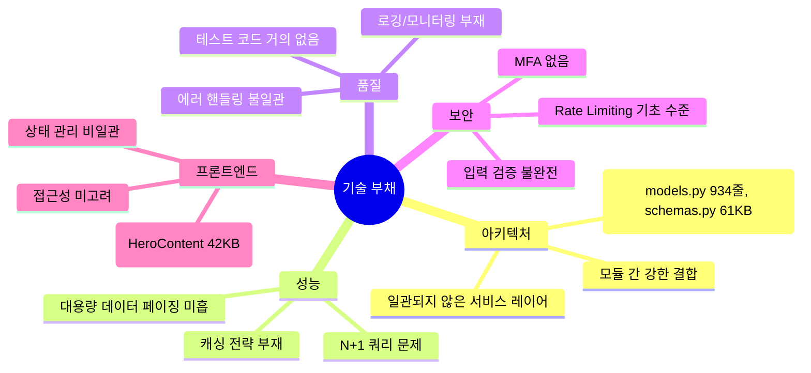

# 🧠 Cortex v2.0 — SaaS-Level Complete Rebuild 계획서

> **목표**: 프로토타입 수준의 기존 Cortex 프로젝트를 분석하고, 그 경험을 바탕으로 **프로덕션 SaaS 수준**의 완전히 새로운 프로젝트를 설계한다.
>
> 📋 **감사 보고서**: 본 계획서는 [14_Cortex_v2_Audit_Report.md](./14_Cortex_v2_Audit_Report.md)의 23건 감사 결과를 반영한 **최종 확정판**이다.

---

## 📊 기존 프로젝트 분석 요약

### 구현 완료된 핵심 기능

| 시스템           | 주요 기능                                                    | 파일 규모                           | 기술 부채                       |
| :--------------- | :----------------------------------------------------------- | :---------------------------------- | :------------------------------ |
| **인증**         | JWT, OAuth(Google/Kakao/Naver), 이메일 인증, 비밀번호 재설정 | `auth.py` 13KB                      | MFA 없음, 세션 관리 부재        |
| **전략 빌더**    | 비주얼 블록 에디터, JSON 규칙, Long/Short, TP/SL, AI Signal  | `strategy/` 22개 파일               | 버전 관리 없음, 코드 모드 없음  |
| **백테스팅**     | Long/Short, 수수료, 슬리피지, 고급 지표(Sharpe 등)           | `backtesting_engine.py` 24KB        | 비교 모드 없음, 몬테카를로 없음 |
| **최적화**       | General + WFO (Optuna 기반), Celery 병렬 처리                | `optimization_service.py` 13KB      | 통계 유의성 검증 부재           |
| **AI Lab**       | LSTM/GRU/TFT, Triple Barrier, ONNX, Walk-Forward Retrain     | `ai/` 16개 파일, `tasks_ai.py` 32KB | 드리프트 감지 없음, 앙상블 없음 |
| **자동매매**     | Celery 기반 봇, 거래소 API 연동                              | `live_trading_engine.py` 13KB       | 리스크 관리 미흡, 알림 부재     |
| **크레딧**       | 원장 기반, 유/무료 구분, 출석 보너스, 만료 정책              | `credit_service.py` 16KB            | 리퍼럴/프로모 코드 없음         |
| **마켓플레이스** | 전략/AI/아이템 판매, P2P 거래, 판매자 정산                   | `marketplace_service.py` 39KB       | 리뷰/평점 없음                  |
| **대시보드**     | 관리자/사용자 대시보드 분리                                  | `dashboard/` 11개 파일              | 커스텀 위젯 없음, UX 미흡       |
| **구독**         | Basic/Trader/Pro, 기능 제한, 결제 게이트웨이                 | `subscription_service.py` 28KB      | Trial 없음, 사용량 측정 부재    |
| **i18n**         | 한국어/영어                                                  | `next-intl` 기반                    | 누락 번역 존재                  |

### 핵심 기술 부채



---

## 🏗️ 새 프로젝트 아키텍처

### 기술 스택 (감사 반영 확정판)

| Layer           | Technology                                                  | 선택 이유                                         |
| :-------------- | :---------------------------------------------------------- | :------------------------------------------------ |
| **Frontend**    | **Next.js 16** (App Router) + **React 19** + TypeScript     | Turbopack, Cache Components, PPR, 최신 React 훅   |
| **CSS**         | **TailwindCSS v4**                                          | CSS-First 설정, Lightning CSS, 자동 콘텐츠 탐지   |
| **UI**          | shadcn/ui + Framer Motion + Lightweight Charts              | 커스터마이징 용이, 금융 차트 최적화               |
| **차트**        | **Apache ECharts** (echarts-for-react) + Lightweight Charts | Canvas 렌더링, 히트맵/등고선, 대용량 성능         |
| **상태 관리**   | React Query v5 (서버) + Zustand (클라이언트 UI만)           | 캐시 자동화, Server Components로 범위 축소        |
| **폼**          | React Hook Form + Zod                                       | 성능 최적화, 스키마 기반 검증                     |
| **타입 생성**   | **openapi-typescript** (자동)                               | FastAPI OpenAPI → TypeScript 타입 자동 생성       |
| **패키지**      | **pnpm**                                                    | 빠른 설치, 엄격한 의존성, 디스크 효율             |
| **Lint/Format** | **Biome**                                                   | Rust 기반 10-100x 빠름, ESLint+Prettier 통합 대체 |
| **Backend**     | FastAPI + Pydantic v2 + SQLAlchemy 2.0 async                | 비동기 API, 자동 문서화, 타입 검증                |
| **엔진 성능**   | **Numba JIT** + 벡터화 NumPy                                | 백테스트 루프 10-100x 성능 향상                   |
| **Task Queue**  | Celery + Redis + **Flower** 모니터링                        | 분산 태스크, 스케줄링, 작업 모니터링              |
| **Database**    | PostgreSQL + TimescaleDB (**Timescale Cloud**)              | 관리형 시계열 DB, 운영 부담 제거                  |
| **Cache**       | Redis (L1: React Query / L2: Redis / L3: DB)                | 계층적 캐싱 전략                                  |
| **Storage**     | **Cloudflare R2** (S3 호환)                                 | 모델 가중치, 아바타, 리포트 — 이그레스 무료       |
| **AI/ML**       | **PyTorch Lightning** + ONNX + Optuna + **MLflow**          | 구조화 학습, 실험 추적, 모델 레지스트리           |
| **실시간**      | **통합 WebSocket Gateway** + Redis Pub/Sub                  | 전 기능 통합 실시간 통신                          |
| **Monitoring**  | Sentry + Structured Logging                                 | 에러 추적, 로그 관리                              |
| **배포 (초기)** | Docker + Vercel (FE) + **Railway** (BE)                     | 간소화 배포, ECS 마이그레이션 경로 확보           |
| **배포 (성장)** | Docker + Vercel (FE) + AWS ECS (BE)                         | 프로덕션 스케일링                                 |
| **CI/CD**       | GitHub Actions + **Biome** + **pip-audit/npm audit**        | 자동 테스트/배포/보안 체크                        |
| **API 설계**    | **`/api/v1/`** 버저닝 + **커서 기반 페이지네이션**          | SaaS 필수 하위 호환성 + 대량 데이터 성능          |

### 백엔드 모듈 구조 (Domain-Driven Design)

```
backend/src/
├── core/                          # 공유 커널
│   ├── config.py                  # 환경 설정
│   ├── database.py                # DB 연결 및 세션 관리
│   ├── security.py                # JWT, 암호화 유틸
│   ├── exceptions.py              # 전역 예외 정의
│   ├── events.py                  # 이벤트 버스 (모듈 간 통신)
│   ├── dependencies.py            # FastAPI 공통 의존성
│   ├── middleware.py              # CORS, Rate Limit, Logging
│   └── redis.py                   # Redis 클라이언트
├── modules/
│   ├── auth/                      # 인증/인가
│   │   ├── models.py              # User, SocialAccount, RefreshToken
│   │   ├── schemas.py             # Request/Response DTO
│   │   ├── router.py              # API 엔드포인트
│   │   ├── service.py             # 비즈니스 로직
│   │   ├── repository.py          # 데이터 접근
│   │   └── oauth/                 # OAuth 프로바이더
│   ├── strategies/                # 전략 관리
│   ├── backtesting/               # 백테스팅 엔진
│   ├── optimization/              # 전략 최적화
│   ├── ai_lab/                    # AI 모델 학습/추론
│   ├── trading/                   # 실전/페이퍼 트레이딩
│   ├── credits/                   # 크레딧 시스템
│   ├── marketplace/               # 마켓플레이스
│   ├── subscriptions/             # 구독/플랜
│   ├── community/                 # 커뮤니티
│   ├── notifications/             # 알림 시스템
│   ├── market_data/               # 시세 데이터 관리
│   └── admin/                     # 관리자 기능
├── workers/                       # Celery 태스크
│   ├── celery_app.py
│   ├── backtest_tasks.py
│   ├── optimization_tasks.py
│   ├── ai_tasks.py
│   ├── trading_tasks.py
│   └── scheduled_tasks.py
└── main.py                        # FastAPI 앱 엔트리포인트
```

### 프론트엔드 구조 (Feature-Based)

```
frontend/src/
├── app/[locale]/
│   ├── (marketing)/               # 랜딩, 가격
│   ├── (auth)/                    # 로그인, 회원가입
│   └── (app)/                     # 인증 필요 페이지
│       ├── dashboard/
│       ├── strategies/
│       ├── backtester/
│       ├── optimization/
│       ├── ai-lab/
│       ├── trading/
│       ├── marketplace/
│       ├── credits/
│       ├── settings/
│       └── admin/
├── components/
│   ├── ui/                        # 기본 UI 컴포넌트 (shadcn/ui)
│   ├── charts/                    # 차트 전용 컴포넌트
│   ├── forms/                     # 폼 전용 컴포넌트
│   └── layouts/                   # 레이아웃 컴포넌트
├── features/                      # 도메인별 기능 컴포넌트
│   ├── auth/
│   ├── strategy-builder/
│   ├── backtesting/
│   ├── optimization/
│   ├── ai-lab/
│   ├── trading/
│   ├── marketplace/
│   ├── credits/
│   └── dashboard/
├── hooks/                         # 공통 커스텀 훅
├── lib/                           # 유틸리티, API 클라이언트
├── store/                         # Zustand 스토어
└── types/                         # 공유 타입 정의
```

---

## 🚀 Sprint별 상세 구현 계획

### Sprint 1: 인프라 & 인증 시스템 (2주)

**Backend**

- [ ] 프로젝트 초기화: FastAPI + Pydantic v2 + SQLAlchemy 2.0 async
- [ ] **[AUDIT]** API 버저닝: 모든 라우터에 `/api/v1/` 프리픽스 적용
- [ ] Docker Compose: PostgreSQL + TimescaleDB + Redis + Celery + Flower
- [ ] Core 모듈: config, database, security, exceptions, middleware
- [ ] **[AUDIT]** 통합 WebSocket Gateway 인프라:
  - 연결 관리, JWT 인증, Redis Pub/Sub 기반 수평 확장
  - 채널 설계: trading, backtest, optimization, ai-training, market, notifications
- [ ] **[AUDIT]** Cloudflare R2 파일 스토리지 연동 (Pre-signed URL)
- [ ] **[AUDIT]** 감사 추적 (Audit Trail): `audit_logs` 테이블 + 이벤트 비동기 기록
- [ ] **[AUDIT]** 계층 캐싱 전략: Redis L2 캐시 레이어 + 무효화 이벤트
- [ ] **[AUDIT]** 표준 에러 응답 포맷 + 커서 기반 페이지네이션 미들웨어
- [ ] 인증 시스템:
  - 이메일/비밀번호 회원가입 (Bcrypt + Argon2)
  - JWT Access/Refresh 토큰 (Redis 블랙리스트)
  - OAuth 2.0 (Google, Kakao, Naver) 계정 연동
  - 이메일 인증 (HTML 템플릿 이메일)
  - 비밀번호 재설정 (시간 제한 토큰)
  - **[NEW]** TOTP 2FA (Google Authenticator 호환)
  - **[NEW]** 활성 세션 관리 (기기별 조회/원격 로그아웃)
  - Rate Limiting (Redis 슬라이딩 윈도우)
- [ ] 사용자 프로필 CRUD (아바타: R2 업로드)
- [ ] Admin API: 사용자 관리
- [ ] Structured Logging + Sentry 연동

**Frontend**

- [ ] **[AUDIT]** Next.js 16 + React 19 프로젝트 초기화 (App Router, TypeScript strict, Turbopack)
- [ ] **[AUDIT]** pnpm 패키지 매니저 + Biome 린터/포매터 설정
- [ ] **[AUDIT]** TailwindCSS v4 설정 (CSS-First, @theme 디렉티브)
- [ ] **[AUDIT]** openapi-typescript 연동: FastAPI → TypeScript 타입 자동 생성 파이프라인
- [ ] 디자인 시스템: 색상 토큰, 타이포그래피, 컴포넌트 기반
- [ ] shadcn/ui 기반 UI Kit 구축
- [ ] 다크/라이트 모드 전환
- [ ] i18n 설정 (next-intl: ko/en)
- [ ] **[AUDIT]** 통합 에러 처리: 라우트별 error.tsx + loading.tsx + Skeleton 패턴
- [ ] 인증 페이지: 로그인, 회원가입, 비밀번호 찾기, 이메일 인증
- [ ] 보호된 라우트 가드 (미들웨어)
- [ ] 반응형 레이아웃 (사이드바 + 헤더)

---

### Sprint 2: 전략 빌더 코어 (2주)

**Backend**

- [ ] Strategy 모듈: CRUD API + Repository 패턴
- [ ] 전략 규칙 스키마 설계:
  - 기술 지표 규칙 (50+ 지표: RSI, MACD, BB, EMA/SMA 등)
  - 가격 액션 규칙 (돌파, 캔들 패턴)
  - AI 신호 규칙 (모델 예측값 활용)
  - 복합 논리 (AND/OR/NOT 그룹핑, 중첩 조건)
  - **[NEW]** 멀티 타임프레임 조건
- [ ] 포지션 관리:
  - Long/Short Entry/Exit 규칙
  - TP/SL (고정%, 트레일링, ATR 기반)
  - **[NEW]** 포지션 사이징 (고정, Kelly, Risk-Parity)
- [ ] 전략 유효성 검증 엔진 (규칙 무결성 검증)
- [ ] **[NEW]** 전략 버전 히스토리 API
- [ ] **[NEW]** 전략 복제/포크 기능
- [ ] 전략 템플릿 시드 데이터 (추세 추종, 평균 회귀 등)
- [ ] Indicator 서비스: TA-Lib/pandas-ta 기반 지표 계산 엔진

**Frontend**

- [ ] 전략 빌더 페이지 (핵심 UI):
  - **비주얼 블록 에디터** (React Flow 또는 커스텀 DnD):
    - 지표 블록 드래그 앤 드롭
    - 조건 연결선
    - 실시간 파라미터 검증
    - 지표 값 차트 미리보기
  - **[NEW]** 코드 모드 (Python-like DSL, 고급 사용자용)
  - 템플릿 라이브러리
  - JSON 내보내기/가져오기
- [ ] 전략 허브 (목록 페이지):
  - 카드 뷰 + 성과 요약
  - 필터링/정렬/검색
  - 빠른 액션 (백테스트, 최적화, 배포, 공유)
- [ ] 전략 상세 페이지:
  - 전략 정보, 백테스트 이력, 성과 차트
  - **[NEW]** 버전 히스토리 + 디프 뷰

---

### Sprint 3: 백테스팅 엔진 (2주)

**Backend**

- [ ] **이벤트 기반 백테스팅 엔진** (완전 재설계):
  - 이벤트 루프: MarketData → Signal → Order → Position → PnL
  - **[AUDIT]** 엔진 코어에 **Numba JIT 컴파일** 적용 (hot path 10-100x 가속)
  - **[AUDIT]** 지표 계산: **벡터화 NumPy + pandas-ta** (루프 대신 벡터 연산)
  - **[AUDIT]** Signal Service를 **파이프라인 패턴**으로 재설계 (단계별 캐시 가능)
  - Signal Service: 모든 규칙 타입 평가, 멀티 타임프레임 집계
  - Order Management: Market/Limit/Stop 주문, 부분 체결 시뮬레이션
  - Commission/Fee 모델: maker/taker 수수료 구분
  - Slippage 모델: Volume 기반, 고정, 확률적
  - Leverage 지원 (1x~125x), 청산가 계산
  - **[NEW]** 펀딩 레이트 시뮬레이션 (무기한 선물)
- [ ] 성과 지표 엔진 (종합, **[AUDIT]** Numba JIT 적용):
  - 기본: Total Return, CAGR, MDD, Win Rate, Profit Factor
  - 위험조정: Sharpe, Sortino, Calmar Ratio
  - 드로다운 분석: 기간, 회복 시간
  - 월별/연도별 수익 분해
  - **[NEW]** 몬테카를로 시뮬레이션
  - **[NEW]** 벤치마크 비교 (BTC Hold, 동일 비중)
  - **[NEW]** 파라미터 민감도 분석
  - 백테스트 종합 점수 (Backtest Score)
- [ ] 백테스트 관리:
  - Celery 큐 (플랜별 우선순위)
  - WebSocket 실시간 진행률 (Sprint 1 통합 WS Gateway 활용)
  - 결과 저장 (요약: PostgreSQL, 에퀴티: TimescaleDB, 거래: PostgreSQL)
  - **[NEW]** 복수 백테스트 비교 API

**Frontend**

- [ ] 백테스트 설정 폼:
  - 전략 선택, 기간, 초기 자본, 수수료, 슬리피지
  - **크레딧 비용 미리보기**
- [ ] 백테스트 결과 대시보드:
  - KPI 카드 (핵심 수치)
  - 에퀴티 커브 차트 (TradingView Lightweight Charts)
  - 드로다운 차트
  - **[NEW]** 월별 수익 히트맵
  - **[NEW]** 수익 분포 히스토그램
  - 거래 내역 테이블 (필터링, 정렬, 가상 스크롤)
  - 개별 거래 인스펙터
  - **[NEW]** 벤치마크 비교 차트
  - **[NEW]** 복수 백테스트 사이드 바이 사이드 비교
- [ ] 백테스트 리스트 (상태별 필터링, 실시간 진행률)
- [ ] **[NEW]** PDF 리포트 생성 + CSV 데이터 내보내기

---

### Sprint 4: 전략 최적화 (2주)

**Backend**

- [ ] **General 최적화 엔진**:
  - 파라미터 자동 발견 (전략 규칙에서 튜닝 가능 파라미터 추출)
  - 탐색 방법: Grid Search, Random Search, Bayesian (Optuna TPE)
  - 목적 함수: 선택 가능 (Sharpe, Return, Sortino, 커스텀 합성)
  - 제약 조건: 최소 거래 수, 최대 MDD, 최소 승률 필터
  - Celery chord/group 기반 병렬 백테스트 실행
- [ ] **Walk-Forward Optimization (WFO)**:
  - 윈도우 설정: IS/OOS 비율, 롤링/앵커/확장 모드, 폴드 수
  - 프로세스: 폴드별 Bayesian IS 최적화 → OOS 검증
  - IS/OOS 성과 일관성 추적
  - 과적합 점수: IS vs OOS 성과 하락 비율
  - 폴드 간 파라미터 안정성 분석
  - **[NEW]** 통계 검증 (t-test, 부트스트랩 신뢰 구간)
- [ ] 최적화 관리:
  - Celery 분리 큐 (플랜별 동시성 제한)
  - WebSocket 실시간 진행률 + 예상 시간
  - 크레딧 사전 비용 산출 API
  - 전략별 최적화 이력 API
  - 원클릭 최적 파라미터 적용

**Frontend**

- [ ] 최적화 설정 페이지:
  - 최적화 유형 선택 (General / WFO)
  - 파라미터 범위 설정 UI (슬라이더, 범위 입력)
  - 목적 함수/제약 조건 설정
  - 크레딧 비용 미리보기
- [ ] 최적화 결과 페이지:
  - General: 파라미터 중요도, 등고선 차트, 히스토리 차트, 상위 Trial 리더보드
  - WFO: 폴드별 에퀴티 커브 (IS/OOS 오버레이), 합산 OOS 커브, 과적합 점수, 파라미터 안정성 차트
  - **원클릭 파라미터 적용** 버튼
- [ ] 최적화 작업 목록 (진행 상황, 큐 위치)

---

### Sprint 5: AI Lab (2주)

**Backend**

- [ ] **데이터 전처리 파이프라인**:
  - Feature Engineering: 50+ 기술 지표 자동 계산
  - **[NEW]** 커스텀 피처 지원 (사용자 정의 공식)
  - 정규화 (MinMax, Standard, Robust)
  - 결측치 처리 (Forward Fill, 보간)
  - 시간 인식 Train/Validation/Test 분할 (미래 데이터 누출 방지)
- [ ] **라벨링 시스템**:
  - Triple Barrier Labeling (Classification: -1/0/1, Regression: 연속값)
  - 설정 가능 배리어 (수익/손실 임계점, 최대 보유 기간)
  - 라벨 분포 분석 및 밸런싱 (SMOTE, Undersampling)
  - **[NEW]** 커스텀 라벨 지원
- [ ] **모델 아키텍처**:
  - LSTM, GRU, TFT (기존)
  - **[NEW]** 앙상블 메서드 (가중 투표/평균)
  - **[NEW]** 커스텀 아키텍처 지원 (레이어 설정)
- [ ] **학습 파이프라인** (**[AUDIT]** PyTorch Lightning 기반):
  - **[AUDIT]** `LightningModule`로 구조화된 학습 코드
  - **[AUDIT]** MLflow 실험 추적 (하이퍼파라미터, 메트릭, 아티팩트)
  - **[AUDIT]** 모델 가중치 R2 스토리지 저장
  - Optuna 하이퍼파라미터 최적화 (Bayesian TPE)
  - Early Stopping, Learning Rate 스케줄링 (Lightning 콜백)
  - 체크포인트 저장 및 재개 (Lightning Checkpoint)
  - WebSocket 실시간 진행률 (에폭별 로그, 손실 커브)
- [ ] **모델 평가**:
  - Classification: Accuracy, F1, AUC-ROC, Confusion Matrix
  - Regression: RMSE, MAE, R², Direction Accuracy
  - Feature Importance (SHAP, Permutation Importance)
  - Prediction vs Actual 차트
- [ ] **추론 & 배포**:
  - ONNX 경량 추론
  - 배치 예측 (백테스팅) + 실시간 예측 (자동매매)
  - 모델 버전 관리
  - **[NEW]** 추론 캐싱 (Redis, 동일 입력)
- [ ] **Walk-Forward Retraining**:
  - 스케줄 기반 재학습
  - **[NEW]** 성능 드리프트 감지
  - **[NEW]** 언더퍼폼 시 자동 이전 버전 폴백
  - 재학습 알림

**Frontend**

- [ ] AI 모델 목록 페이지 (상태, 성능, 빠른 액션)
- [ ] AI 모델 생성 페이지:
  - 모델 타입/아키텍처 선택
  - 피처 설정 UI
  - 라벨링 설정 UI
  - 학습 설정 (에폭, 배치, 타임프레임)
  - 크레딧 비용 미리보기
- [ ] AI 모델 상세 페이지:
  - 학습 진행률 (실시간 손실 커브)
  - 모델 성능 평가 차트
  - 피처 중요도 차트
  - 버전 관리 테이블
  - 재학습 다이얼로그
  - 예측 테스트 UI

---

### Sprint 6: 자동매매 & 페이퍼 트레이딩 (2주)

**Backend**

- [ ] **거래소 통합** (CCXT):
  - 멀티 거래소 지원 (Binance, Upbit, Bybit 등)
  - WebSocket 실시간 시세 스트리밍
  - REST API 폴백 (주문 관리)
  - 거래소별 Rate Limiting
  - 연결 헬스 모니터링 + 자동 재연결
- [ ] **봇 라이프사이클 관리**:
  - 생성 → 설정 → 시작 → 모니터링 → 일시정지 → 재개 → 종료
  - 정상 종료 (열린 포지션 처리 옵션)
  - 실패 시 자동 재시작 (백오프)
- [ ] **리스크 관리 시스템** (핵심):
  - 일일 최대 손실 한도 (자동 정지)
  - 최대 포지션 크기 제한
  - 최대 동시 포지션 수
  - 플랜별 최대 레버리지 제한
  - 드로다운 서킷 브레이커
  - **[NEW]** 봇별 + 포트폴리오 수준 리스크 한도
  - **긴급 전체 중지 버튼**
- [ ] **주문 실행**:
  - Market/Limit/Stop 주문
  - 지수 백오프 기반 주문 재시도
  - 주문 상태 추적 및 정합성 검증
  - 체결 확인 및 PnL 계산
- [ ] **모니터링 & 알림**:
  - WebSocket 실시간 PnL
  - 거래 실행 알림 (인앱, 이메일, **[NEW]** 텔레그램)
  - 일간/주간 성과 요약 이메일
  - 이상 탐지 알림 (비정상 손실, 거래소 에러)
- [ ] **페이퍼 트레이딩 엔진**:
  - 가상 거래소 시뮬레이터 (실시간 시세 기반)
  - 가상 포트폴리오 관리
  - 현실적: 수수료, 슬리피지, 지연 시뮬레이션
  - 페이퍼 → 라이브 원활한 전환

**Frontend**

- [ ] 봇 관리 페이지:
  - 활성 봇 그리드/리스트 뷰 (상태, PnL, 가동 시간)
  - 봇 생성: 전략 선택, API 키 선택, 자본 설정, 리스크 한도 설정
  - 봇 상세: 실시간 PnL 차트, 거래 이력, 로그
  - 긴급 전체 중지 버튼
- [ ] 포트폴리오 요약: 총 AUM, 일간 PnL, 자산 배분, 성과 차트
- [ ] 페이퍼 트레이딩 페이지:
  - 가상 포트폴리오 대시보드
  - 페이퍼 → 라이브 전환 UI
  - **[NEW]** 페이퍼 vs 라이브 성과 비교

---

### Sprint 7: 크레딧 시스템 & 결제 (2주)

**Backend**

- [ ] **크레딧 원장 시스템** (이중 회계 영감):
  - Credits Ledger: 획득 단위별 기록 (source_type, 만료일)
  - 소비: 만료일 FIFO, 무료(이벤트 > 출석 > 구독) → 유료 순
  - Transaction Details: 어떤 원장에서 얼마 차감됐는지 추적
- [ ] **크레딧 획득 경로**:
  - 현금 충전 (결제 게이트웨이)
  - 일일 출석 보너스 (3/7/14/30일 연속 보너스)
  - 구독 갱신 보너스
  - **[NEW]** 프로모션 코드
  - **[NEW]** 추천인(리퍼럴) 보상
- [ ] **크레딧 사용처** (비용 계산기):
  - 백테스트 (기간, 페어 수, 타임프레임 기반)
  - 최적화 (트라이얼 수, WFO 폴드 기반)
  - AI 학습 (에폭, 모델 복잡도 기반)
  - 자동매매 활성화 (일간/시간당 크레딧 소모)
  - 마켓플레이스 구매
- [ ] 크레딧 만료 정책: 무료 크레딧 주간 만료 (다음 월요일 00:00 KST)
- [ ] 환불: 미사용 유료 원장만 환불 가능
- [ ] **구독 시스템**:
  - 플랜: Free / Starter / Pro / Enterprise
  - 기능 제한 미들웨어 (플랜별)
  - **[NEW]** 14일 Pro 무료 체험
  - **[NEW]** 사용량 측정 (API 호출, 백테스트 횟수 등)
  - 월간/연간 결제 (Toss Payments / Portone)
  - Webhook 처리 (결제 확인, 구독 갱신/취소)

**Frontend**

- [ ] 크레딧 스토어 페이지:
  - 크레딧 패키지 구매 (볼륨 디스카운트)
  - 잔액 표시 + 사용 이력 차트
  - 출석 체크 UI (달력 + 연속 출석 트래커)
  - **[NEW]** 프로모션 코드 입력
- [ ] 구독 관리 페이지:
  - 플랜 비교 테이블
  - 결제 플로우 (PG 연동)
  - 구독 상태, 취소 UI
  - **[NEW]** 사용량 대시보드

---

### Sprint 8: 마켓플레이스 (2주)

**Backend**

- [ ] **상품 관리**:
  - 상품 타입: Strategy (P2P), AI Model (P2P), Shop Item (B2C), Credit Pack (B2C)
  - 상품 등록/수정/비활성화 API
  - 대표 백테스트 결과 연동
  - **[NEW]** 상품 리뷰/평점 시스템
- [ ] **판매자 기능**:
  - 판매자 대시보드 API (판매 분석)
  - 수익 추적 및 정산 관리
  - **[NEW]** 판매자 인증/등급 시스템
- [ ] **구매자 기능**:
  - 상품 검색 (트렌딩, 최고 평점, 최신)
  - 카테고리 필터링 & 전문 검색
  - 구매 이력 (인벤토리)
  - **[NEW]** 위시리스트
- [ ] **정산 시스템**:
  - 월간 정산 사이클 (KRW 지급)
  - 플랫폼 수수료 (예: 20%)
  - 세금 보고 데이터 생성
- [ ] **인벤토리 시스템**:
  - 구매한 전략/AI/아이템 관리
  - UNLOCK (영구) / CONSUMABLE (소모성) 구분

**Frontend**

- [ ] 마켓플레이스 메인 페이지:
  - 상품 카드 그리드 (성과 미리보기)
  - 카테고리 탭 (전략, AI 모델, 아이템, 크레딧)
  - 검색 + 필터 (가격, 평점, 카테고리, 포지션 타입)
  - 트렌딩/추천 섹션
- [ ] 상품 상세 페이지:
  - 전략: 백테스트 결과, 성과 차트, 규칙 미리보기
  - AI 모델: 학습 성능, 피처 중요도, 예측 정확도
  - **[NEW]** 리뷰/평점 섹션
  - 구매 버튼 (크레딧 차감)
- [ ] 판매자 대시보드:
  - 판매 현황, 수익 차트
  - 상품 관리 (등록, 수정, 비활성화)
  - 정산 내역
- [ ] 인벤토리 페이지: 구매한 아이템 목록 + 빠른 액션

---

### Sprint 9: 대시보드 & 커뮤니티 (2주)

**Backend**

- [ ] **대시보드 API**:
  - 포트폴리오 요약 (총 AUM, 일/주/월 PnL)
  - 활성 봇 요약
  - 최근 백테스트 결과
  - 크레딧 잔액 + 사용 추세
  - **[NEW]** 시장 개요 (상위 종목, 공포/탐욕 지수)
  - 알림 센터 API
- [ ] **관리자 대시보드 API**:
  - 사용자 관리 (검색, 정지, 인증, 구독 오버라이드)
  - 플랫폼 메트릭 (총 사용자, 활성 봇, 수익)
  - 시스템 헬스 (Celery 워커, DB 연결, Redis)
  - 크레딧 경제 개요 (총 발행/소비/만료)
  - 마켓플레이스 모더레이션
  - 정산 처리
- [ ] **커뮤니티 기능**:
  - 게시글 CRUD (백테스트 결과 공유)
  - 댓글 시스템
  - 좋아요/추천
  - **[NEW]** 팔로우 시스템
  - **[NEW]** 활동 피드
- [ ] **알림 시스템** (통합):
  - 인앱 알림 (실시간 WebSocket)
  - 이메일 알림 (HTML 템플릿)
  - **[NEW]** 텔레그램 봇 알림
  - 알림 설정 (카테고리별 on/off)

**Frontend**

- [ ] **사용자 대시보드** (완전 재설계):
  - **[NEW]** 커스터마이징 가능한 위젯 그리드 (드래그 앤 드롭)
  - 위젯 타입: 차트, 통계 카드, 테이블, 활동 피드, 마켓 개요
  - 포트폴리오 요약 위젯
  - 활성 봇 요약 위젯
  - 크레딧 잔액 위젯
  - 최근 백테스트 위젯
  - **[NEW]** 전략 성과 리더보드 위젯
  - 알림 센터 위젯
  - 빠른 액션 바로가기
  - 레이아웃 저장/불러오기
- [ ] **관리자 대시보드** (완전 재설계):
  - 플랫폼 핵심 KPI 카드
  - 사용자 관리 테이블 (검색, 필터, 액션)
  - 시스템 헬스 모니터
  - 크레딧 경제 차트
  - 정산 관리 테이블
- [ ] **커뮤니티 페이지**:
  - 피드 (최신, 인기)
  - 게시글 상세 (백테스트 결과 임베드, 댓글, 좋아요)
  - **[NEW]** 사용자 프로필 페이지 (공개 통계, 전략 목록, 팔로워)

---

### Sprint 10: 폴리시, 테스트, 배포 (2주)

**랜딩 페이지 (완전 재설계)**

- [ ] 프리미엄 히어로 섹션 (동적 트레이딩 애니메이션)
- [ ] 기능 소개 (인터랙티브 벤토 그리드)
- [ ] 가격 혜택 페이지 (플랜 비교 테이블)
- [ ] CTA 섹션 (무료 체험 유도)
- [ ] 반응형 (모바일/태블릿/데스크톱)

**테스트**

- [ ] Backend: pytest (단위 + 통합) — 80%+ 커버리지 목표
- [ ] **[AUDIT]** 백테스트 엔진: Property-Based Testing (Hypothesis)
- [ ] Frontend: Vitest + React Testing Library (컴포넌트 테스트)
- [ ] E2E: Playwright (핵심 사용자 플로우)
- [ ] **[AUDIT]** Playwright 시각적 회귀 테스트 (스크린샷 비교)
- [ ] 부하 테스트: Locust (병목 식별)
- [ ] **[AUDIT]** 보안 스캔: Bandit (Python), pip-audit, npm audit → CI 연동

**배포 & 인프라**

- [ ] Docker 컨테이너화 (multi-stage build)
- [ ] GitHub Actions CI/CD (Biome lint → test → build → deploy)
- [ ] Frontend: Vercel 배포 (프리뷰 + 프로덕션)
- [ ] **[AUDIT]** Backend: Railway 배포 (초기) → AWS ECS 마이그레이션 경로 확보
- [ ] **[AUDIT]** Database: Timescale Cloud (관리형 PostgreSQL + TimescaleDB)
- [ ] **[AUDIT]** Redis: Upstash 또는 Railway Redis
- [ ] **[AUDIT]** Storage: Cloudflare R2 (모델 가중치, 아바타, 리포트)
- [ ] 도메인/SSL 설정
- [ ] 모니터링: Sentry + Structured Logging + Flower (Celery)
- [ ] **[NEW]** Staging 환경 구축
- [ ] **[NEW]** PWA 설정 (푸시 알림, 홈 화면 설치)

**최종 품질 보증**

- [ ] 전체 사용자 플로우 수동 테스트
- [ ] 성능 최적화 (Lighthouse 90+ 목표)
- [ ] 보안 검토 (OWASP Top 10 체크)
- [ ] 접근성 검토 (WCAG 2.1 AA)
- [ ] SEO 최적화 (메타태그, OG, sitemap)

---

## 📐 데이터베이스 스키마 (v2.0 Enhanced)

> 기존 25+ 테이블 구조를 유지하면서, 아래 주요 변경/추가 사항 반영

### 신규/변경 테이블

| 테이블              | 변경 유형       | 설명                                              |
| :------------------ | :-------------- | :------------------------------------------------ |
| `mfa_secrets`       | **NEW**         | TOTP 2FA 시크릿 키, 백업 코드 저장                |
| `user_sessions`     | **NEW**         | 활성 세션 관리 (기기, IP, 마지막 활동)            |
| `strategy_versions` | **NEW**         | 전략 버전 히스토리 (디프 저장)                    |
| `product_reviews`   | **NEW**         | 마켓플레이스 상품 리뷰/평점                       |
| `referral_codes`    | **NEW**         | 추천인 코드 및 보상 추적                          |
| `promo_codes`       | **NEW**         | 프로모션 코드 (일회성/다회성)                     |
| `user_follows`      | **NEW**         | 사용자 팔로우 관계                                |
| `notifications`     | **NEW**         | 인앱 알림 저장                                    |
| `dashboard_layouts` | **NEW**         | 사용자별 대시보드 위젯 레이아웃                   |
| `usage_meters`      | **NEW**         | 플랜별 사용량 측정 (API 호출, 백테스트 등)        |
| `wishlist_items`    | **NEW**         | 마켓플레이스 위시리스트                           |
| `audit_logs`        | **NEW** [AUDIT] | 보안 감사 추적 (API키, 봇, 크레딧, 비밀번호 변경) |

---

## ✅ Verification Plan

> 이 프로젝트는 계획(Planning) 문서이므로 코드 변경이 없습니다. 검증은 다음과 같이 진행합니다:

### 문서 검증

- **기능 누락 확인**: 기존 프로젝트의 모든 기능(18개 API 라우터, 30개 서비스, AI 파이프라인, 3개 엔진)이 새 계획에 포함되었는지 체크
- **신규 기능 확인**: 각 Sprint에 `[NEW]` 태그로 표시된 항목이 기존에 없던 기능인지 확인
- **의존성 순서 확인**: Sprint 간 기능 의존성이 올바른 순서로 구성되었는지 검증

### 사용자 리뷰

- 사용자가 이 계획서를 검토하고, 누락된 기능이나 우선순위 조정이 필요한 부분을 피드백
