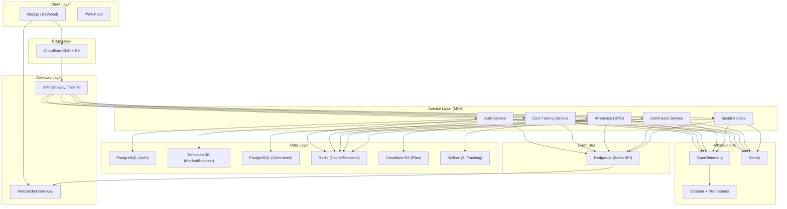
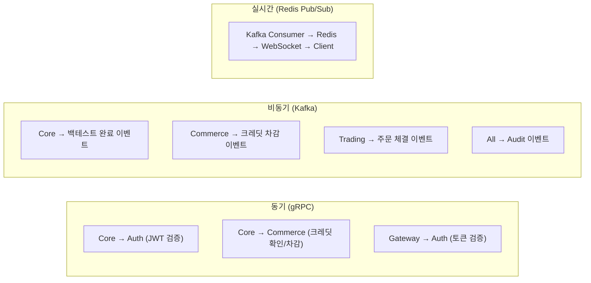

# 🧠 NullVest v2.0 — 최종 프로덕션 아키텍처 계획서

> **목표**: MSA-First, 이벤트 기반, 프로덕션 SaaS 수준의 암호화폐 퀀트 트레이딩 플랫폼
> **기준일**: 2026-02-13 | **총 기간**: 11 Sprint (Sprint 0 포함, 약 21주)

---

## 1. 시스템 아키텍처 개요



---

## 2. 확정 기술 스택

### 2.1 Frontend

| 분야               | 기술                                            | 선택 이유                                        |
| :----------------- | :---------------------------------------------- | :----------------------------------------------- |
| Framework          | **Next.js 16** + **React 19** + TypeScript 5.5+ | Turbopack, Cache Components, PPR, Server Actions |
| CSS                | **TailwindCSS v4**                              | CSS-First, Lightning CSS, 자동 콘텐츠 탐지       |
| UI Kit             | shadcn/ui + Radix UI                            | 커스터마이징, 접근성 내장                        |
| 금융 차트          | **Lightweight Charts** (TradingView)            | OHLCV 캔들, 에퀴티 커브                          |
| 분석 차트          | **Apache ECharts** (echarts-for-react)          | 히트맵, 등고선, Canvas 고성능                    |
| 전략 빌더          | **React Flow**                                  | 노드 기반 비주얼 에디터                          |
| 서버 상태          | **TanStack Query v5**                           | 캐시, 프리페치, 옵티미스틱                       |
| 클라이언트 상태    | **Zustand** (최소 범위)                         | WebSocket 데이터, UI 상태만                      |
| URL 상태           | **nuqs**                                        | 필터/페이지네이션 URL 직렬화                     |
| 테이블/가상 스크롤 | **TanStack Table + Virtual**                    | 대용량 거래 내역 렌더링                          |
| 애니메이션         | **Framer Motion**                               | 선언적 애니메이션                                |
| 폼                 | React Hook Form + **Zod**                       | 스키마 기반 검증                                 |
| 패키지 매니저      | **pnpm**                                        | 빠른 설치, 엄격한 의존성                         |
| 모노레포           | **Turborepo**                                   | 영향받은 서비스만 빌드/테스트                    |
| Lint/Format        | **Biome**                                       | Rust 기반 10-100x 빠름                           |
| 타입 생성          | **openapi-typescript**                          | FastAPI OpenAPI → TS 자동                        |
| API 모킹           | **MSW v2**                                      | Service Worker 기반                              |
| 테스트             | Vitest + Testing Library + **Playwright**       | 단위/컴포넌트/E2E                                |

### 2.2 Backend

| 분야           | 기술                                                       | 선택 이유                                   |
| :------------- | :--------------------------------------------------------- | :------------------------------------------ |
| Language       | **Python 3.12+**                                           | 서브인터프리터, 성능 개선                   |
| 패키지 매니저  | **UV** (Astral)                                            | Rust 기반, pip 대비 10-100x 빠름            |
| Framework      | **FastAPI** + **Pydantic v2** strict                       | 비동기, 자동 문서화, 엄격 검증              |
| ORM            | **SQLAlchemy 2.0** async + **asyncpg**                     | 최고 성능 PostgreSQL 드라이버               |
| Migration      | **Alembic**                                                | 버전 관리, 되돌리기 가능                    |
| 엔진 성능      | **Numba JIT** + 벡터화 NumPy                               | 핫 패스 10-100x 가속                        |
| Task Queue     | **Celery** + Redis + **Flower**                            | 분산 태스크, 모니터링                       |
| 이벤트 스트림  | **Redpanda** (Kafka API 호환)                              | 이벤트 소싱, 서비스 간 디커플링, JVM 불필요 |
| 서비스 간 동기 | **gRPC** (grpcio)                                          | HTTP/2, 강타입, REST 대비 10x 빠름          |
| AI 학습        | **PyTorch Lightning**                                      | 구조화 학습, 콜백, Mixed Precision          |
| AI 추적        | **MLflow**                                                 | 실험 추적, 모델 레지스트리                  |
| AI 추론        | **ONNX Runtime**                                           | 경량 프로덕션 추론                          |
| HPO            | **Optuna**                                                 | Bayesian TPE, 가지치기                      |
| 로깅           | **structlog** (JSON)                                       | 구조화, Correlation ID                      |
| 분산 추적      | **OpenTelemetry**                                          | 서비스 간 트레이싱 표준                     |
| 에러 추적      | **Sentry**                                                 | 소스맵, 릴리즈 추적                         |
| 테스트         | pytest + **Hypothesis** + **testcontainers** + Factory Boy | 단위/속성기반/통합                          |
| 부하 테스트    | **Locust**                                                 | Python 기반 분산 부하                       |
| 보안           | Bandit + pip-audit + Trivy                                 | SAST/의존성/컨테이너 스캔                   |

### 2.3 Infrastructure

| 분야           | 기술                                     | 비고                            |
| :------------- | :--------------------------------------- | :------------------------------ |
| FE 배포        | **Vercel**                               | Next.js 최적, Edge Network      |
| BE 배포 (초기) | **Railway**                              | 간소화, 서비스별 독립 배포      |
| BE 배포 (성장) | **Kubernetes** (EKS/GKE)                 | 프로덕션 오케스트레이션         |
| API Gateway    | **Traefik**                              | K8s 네이티브, 자동 인증서       |
| Database       | **Timescale Cloud**                      | 관리형 PostgreSQL + TimescaleDB |
| Redis          | **Upstash** 또는 ElastiCache             | 서버리스 / 관리형               |
| Event Stream   | **Redpanda** (자체) 또는 Confluent Cloud | Kafka 호환, 경량                |
| Object Storage | **Cloudflare R2**                        | S3 호환, 이그레스 무료          |
| CDN            | **Cloudflare**                           | 글로벌 엣지                     |
| Observability  | **Grafana** + Prometheus + Loki          | 메트릭/로그/대시보드            |
| Tracing        | **Jaeger** 또는 Grafana Tempo            | 분산 트레이싱 시각화            |
| CI/CD          | **GitHub Actions** + Turborepo           | 영향 서비스만 빌드              |
| IaC            | **Terraform**                            | 인프라 코드화                   |
| 로컬 개발      | **Docker Compose**                       | 전 서비스 원커맨드 실행         |

---

## 3. MSA 서비스 설계

### 3.1 서비스 경계 (Bounded Context)

| #   | 서비스           | 소유 도메인                         | DB          | 통신                                  |
| :-- | :--------------- | :---------------------------------- | :---------- | :------------------------------------ |
| 1   | **Gateway**      | 라우팅, Rate Limit, JWT 검증        | —           | REST → 내부 서비스                    |
| 2   | **Auth Service** | 사용자, OAuth, MFA, 세션, API Key   | PostgreSQL  | gRPC (검증), Kafka (이벤트)           |
| 3   | **Core Trading** | 전략, 백테스팅, 최적화, 시세 데이터 | TimescaleDB | Kafka (결과 이벤트)                   |
| 4   | **AI Service**   | 모델 학습, 추론, 피처 엔지니어링    | PostgreSQL  | Kafka (학습 이벤트), R2 (가중치)      |
| 5   | **Commerce**     | 크레딧, 결제, 구독, 마켓플레이스    | PostgreSQL  | gRPC (잔액 조회), Kafka (거래 이벤트) |
| 6   | **Social**       | 커뮤니티, 알림, 대시보드, 관리자    | PostgreSQL  | Kafka (소비자)                        |
| 7   | **Real-time**    | WebSocket 게이트웨이, 이벤트 팬아웃 | —           | Redis Pub/Sub + Kafka 소비            |

### 3.2 Kafka 이벤트 토픽 설계

```
nullvest.auth.user-registered        # 사용자 가입 이벤트
nullvest.auth.user-login             # 로그인 이벤트 (감사)
nullvest.strategy.created            # 전략 생성
nullvest.strategy.updated            # 전략 수정
nullvest.backtest.started            # 백테스트 시작
nullvest.backtest.progress           # 백테스트 진행률
nullvest.backtest.completed          # 백테스트 완료
nullvest.optimization.completed      # 최적화 완료
nullvest.ai.training-started         # AI 학습 시작
nullvest.ai.training-progress        # AI 학습 진행 (에폭)
nullvest.ai.training-completed       # AI 학습 완료
nullvest.trading.order-executed      # 주문 체결
nullvest.trading.position-changed    # 포지션 변경
nullvest.trading.bot-status-changed  # 봇 상태 변경
nullvest.credits.deducted            # 크레딧 차감
nullvest.credits.recharged           # 크레딧 충전
nullvest.marketplace.purchased       # 마켓플레이스 구매
nullvest.notification.send           # 알림 발송 요청
nullvest.audit.action                # 감사 로그
```

### 3.3 서비스 간 통신 패턴



---

## 4. 성능 최적화 전략

### 4.1 Frontend (Core Web Vitals 목표)

| 지표     | 목표    | 전략                                                                                            |
| :------- | :------ | :---------------------------------------------------------------------------------------------- |
| **FCP**  | < 1.0s  | Server Components, Streaming SSR, `next/font` preload, Critical CSS (Tailwind v4 Lightning CSS) |
| **LCP**  | < 1.5s  | PPR (Partial Prerendering), `next/image` priority, Route prefetch, Edge CDN                     |
| **INP**  | < 200ms | `React.startTransition`, `useOptimistic`, Web Worker 분산                                       |
| **CLS**  | < 0.1   | 고정 치수 이미지/차트, Skeleton 매칭 레이아웃                                                   |
| **TTFB** | < 500ms | Edge 렌더링, Streaming SSR, Redis L2 캐시                                                       |

**번들 최적화:**

- `next/dynamic`으로 차트/에디터 지연 로드 (ECharts ~100KB, React Flow ~80KB)
- Turbopack 자동 트리셰이킹
- `@next/bundle-analyzer`로 번들 감시
- Route 세그먼트별 자동 코드 스플리팅

**대용량 데이터:**

- TanStack Virtual: 거래 내역 수만건 가상 스크롤
- Canvas 차트 (ECharts, Lightweight Charts): DOM 아닌 Canvas 렌더링
- Web Worker: 지표 계산 오프로드
- Cursor 기반 무한 스크롤
- IndexedDB: 클라이언트 대용량 캐시

### 4.2 Backend 성능

| 영역           | 전략                                                                              |
| :------------- | :-------------------------------------------------------------------------------- |
| **API 처리량** | FastAPI + uvicorn (멀티 워커) + asyncpg (비동기 DB) + brotli 압축                 |
| **엔진 성능**  | Numba JIT (이벤트 루프 10-100x), 벡터화 NumPy (지표 계산)                         |
| **DB 성능**    | pgbouncer (연결 풀), 읽기 레플리카, BRIN 인덱스 (시계열), 지속 집계 (TimescaleDB) |
| **분산 처리**  | Celery 분리 큐 (backtest/optimization/ai), 태스크 청킹                            |
| **고가용성**   | 서비스별 수평 스케일링, Circuit Breaker, 재시도 + 백오프                          |

### 4.3 캐싱 계층 (L1~L4)

| 계층   | 위치                              | TTL           | 대상                               |
| :----- | :-------------------------------- | :------------ | :--------------------------------- |
| **L1** | React Query (클라이언트)          | 5분 staleTime | API 응답                           |
| **L2** | Vercel Edge Cache                 | ISR 60s       | 마케팅/정적 페이지                 |
| **L3** | Redis                             | 1h~24h        | 시세, 지표, 사용자 설정, 계산 결과 |
| **L4** | TimescaleDB Continuous Aggregates | 실시간 갱신   | 1m→5m→1h→1d OHLCV 롤업             |

**무효화**: Kafka 이벤트 기반 — 전략 수정 시 관련 캐시 자동 무효화

---

## 5. 아키텍처 패턴

### 5.1 Backend 핵심 패턴

| 패턴                 | 적용 대상                | 설명                                                |
| :------------------- | :----------------------- | :-------------------------------------------------- |
| **CQRS**             | 크레딧, 대시보드         | 쓰기(Kafka 이벤트)와 읽기(마티리얼라이즈드 뷰) 분리 |
| **Event Sourcing**   | 크레딧 원장, 거래 내역   | 이벤트 로그가 진실의 원천, 잔액은 파생              |
| **Saga**             | 백테스트 실행, 마켓 구매 | 분산 트랜잭션 보상 패턴                             |
| **Repository + UoW** | 전 서비스                | DB 추상화, 트랜잭션 경계 관리                       |
| **Pipeline**         | Signal Service           | Data → Indicators → Rules → Signals (단계별 캐시)   |
| **Circuit Breaker**  | 거래소 API, 외부 결제    | 장애 전파 차단 (tenacity)                           |

### 5.2 Frontend 핵심 패턴

| 패턴                          | 적용                  | 설명                                |
| :---------------------------- | :-------------------- | :---------------------------------- |
| **Server Components Default** | 전 페이지             | `"use client"` 없으면 서버 컴포넌트 |
| **Server Actions**            | 폼 제출, 뮤테이션     | API 라우트 대신 Server Actions      |
| **Streaming SSR**             | 대시보드, 결과 페이지 | 중첩 Suspense로 점진적 로딩         |
| **Optimistic Updates**        | 좋아요, 전략 저장     | `useOptimistic`으로 즉각 피드백     |
| **Parallel Routes**           | 모달, 드로어          | 뒤로가기 가능한 모달 패턴           |
| **Query Key Factory**         | TanStack Query        | 타입 안전한 캐시 키 관리            |

---

## 6. 프로젝트 구조 (Turborepo 모노레포)

```
nullvest/
├── apps/
│   ├── web/                    # Next.js 16 프론트엔드
│   │   ├── app/[locale]/
│   │   │   ├── (marketing)/    # 랜딩, 가격 (ISR)
│   │   │   ├── (auth)/         # 로그인/가입
│   │   │   └── (app)/          # 인증 필요 영역
│   │   ├── components/         # UI 컴포넌트 (Atomic)
│   │   ├── features/           # 도메인 기능
│   │   ├── hooks/              # 커스텀 훅
│   │   ├── lib/                # 유틸, API 클라이언트
│   │   └── store/              # Zustand (최소)
│   ├── gateway/                # Traefik + 설정
│   ├── auth-service/           # FastAPI 인증 서비스
│   ├── core-service/           # 전략/백테스트/최적화/시세
│   ├── ai-service/             # PyTorch Lightning + MLflow
│   ├── commerce-service/       # 크레딧/결제/마켓
│   ├── social-service/         # 커뮤니티/알림/관리자
│   └── realtime-service/       # WebSocket Gateway
├── packages/
│   ├── shared-types/           # openapi-typescript 생성 타입
│   ├── kafka-events/           # 이벤트 스키마 (Avro/JSON Schema)
│   ├── proto/                  # gRPC Proto 정의
│   ├── shared-utils/           # 공통 유틸 (Python/TS)
│   └── config/                 # Biome, Docker 공유 설정
├── infra/
│   ├── docker-compose.yml      # 로컬 개발 (전 서비스)
│   ├── docker-compose.test.yml # 통합 테스트
│   ├── k8s/                    # Kubernetes 매니페스트
│   └── terraform/              # IaC
├── turbo.json                  # Turborepo 파이프라인
├── pnpm-workspace.yaml         # pnpm 워크스페이스
└── biome.json                  # Biome 설정
```

---

## 7. Sprint 상세 계획

### Sprint 0: 파운데이션 (1주)

- [ ] Turborepo 모노레포 초기화 (pnpm workspace)
- [ ] Docker Compose: PostgreSQL + TimescaleDB + Redis + Redpanda + MLflow
- [ ] 서비스 템플릿 생성기 (FastAPI boilerplate)
- [ ] packages/ 초기화: shared-types, kafka-events, proto, config
- [ ] GitHub Actions CI 스켈레톤 (Biome lint → type check → test → build)
- [ ] Biome + TypeScript strict + Python UV 설정
- [ ] `.env.example` + Docker secrets 구조

---

### Sprint 1: 인프라 코어 & 인증 (2주)

**Gateway + Auth Service**

- [ ] Traefik API Gateway 설정 (라우팅, Rate Limit, CORS, JWT 미들웨어)
- [ ] API 버저닝: `/api/v1/` 프리픽스
- [ ] Auth Service (FastAPI):
  - 이메일/비밀번호 (Argon2id)
  - JWT Access (15분) + Refresh (7일) + Redis 블랙리스트
  - OAuth 2.0 (Google, Kakao, Naver)
  - TOTP 2FA (Google Authenticator) + 백업 코드
  - 활성 세션 관리 (기기별 조회/원격 로그아웃)
  - API Key CRUD (AES-256-GCM 암호화)
  - 이메일 인증 + 비밀번호 재설정
  - Rate Limiting (Redis 슬라이딩 윈도우)
- [ ] gRPC 인증 검증 서비스 (다른 서비스가 호출)

**Real-time Service**

- [ ] WebSocket Gateway (FastAPI WebSocket + Redis Pub/Sub)
- [ ] Kafka Consumer → Redis Pub/Sub → WebSocket Fan-out
- [ ] 채널: `/ws/{service}/{resource_id}`
- [ ] JWT 인증 + 재연결 로직

**Infrastructure**

- [ ] Redpanda 클러스터 + 이벤트 토픽 생성
- [ ] Kafka 이벤트 스키마 정의 (packages/kafka-events)
- [ ] gRPC Proto 정의 (packages/proto)
- [ ] Cloudflare R2 연결 (Pre-signed URL 유틸)
- [ ] 감사 추적 (Audit Trail): Kafka `nullvest.audit.action` 토픽 → 영구 저장
- [ ] structlog + OpenTelemetry + Sentry 초기 연동
- [ ] 공통: 에러 응답 포맷, 커서 페이지네이션, Health Check

**Frontend**

- [ ] Next.js 16 + React 19 초기화 (Turbopack, TypeScript strict)
- [ ] TailwindCSS v4 (CSS-First, @theme)
- [ ] shadcn/ui 기반 UI Kit + 다크/라이트 모드
- [ ] i18n (next-intl: ko/en)
- [ ] openapi-typescript 파이프라인 (자동 타입 생성)
- [ ] 라우트별 error.tsx + loading.tsx + Skeleton 패턴
- [ ] 인증 페이지 (로그인, 가입, 2FA, OAuth)
- [ ] 라우트 가드 미들웨어 + 반응형 레이아웃

---

### Sprint 2: 전략 빌더 (2주)

**Core Service — Strategy Module**

- [ ] Strategy CRUD + Repository 패턴
- [ ] 전략 규칙 스키마 (50+ 지표, 복합 논리, 멀티 타임프레임)
- [ ] 포지션 관리: Long/Short, TP/SL (고정/트레일링/ATR), 포지션 사이징
- [ ] 전략 유효성 검증 엔진
- [ ] 전략 버전 히스토리 (디프 저장)
- [ ] 전략 복제/포크 + 템플릿 시드
- [ ] Kafka 이벤트: `nullvest.strategy.created/updated`

**Core Service — Market Data Module**

- [ ] CCXT 기반 OHLCV 수집기 (TimescaleDB 저장)
- [ ] TimescaleDB Continuous Aggregates (1m→5m→1h→1d)
- [ ] BRIN 인덱스 (시계열 최적화)
- [ ] Redis 캐시 (최신 가격)
- [ ] 시세 데이터 갭 탐지 + 자동 백필

**Frontend**

- [ ] 비주얼 블록 에디터 (React Flow): 지표 DnD, 조건 연결, 실시간 검증
- [ ] DSL 코드 모드 (고급 사용자)
- [ ] 전략 허브: 카드 뷰, 필터/정렬, 빠른 액션
- [ ] 전략 상세: 버전 히스토리 + 디프 뷰

---

### Sprint 3: 백테스팅 엔진 (2주)

**Core Service — Backtesting Module**

- [ ] **Numba JIT 이벤트 기반 엔진**:
  - `@numba.jit(nopython=True)` 핫 패스
  - 파이프라인: Data → Indicators(벡터 NumPy) → Rules → Signals → Orders → PnL
  - Market/Limit/Stop 주문, 부분 체결, maker/taker 수수료
  - Slippage (Volume/고정/확률적), Leverage (1x~125x), 펀딩 레이트
- [ ] 성과 지표 (Numba JIT):
  - 기본 (Return, CAGR, MDD, Win Rate, Profit Factor)
  - 위험조정 (Sharpe, Sortino, Calmar)
  - 몬테카를로, 벤치마크, 파라미터 민감도
- [ ] Celery 분산 실행 (플랜별 우선순위 큐)
- [ ] Kafka: `nullvest.backtest.started/progress/completed`
- [ ] gRPC: Commerce 크레딧 확인 → 차감 (Saga 패턴)

**Frontend**

- [ ] 백테스트 설정 폼 (크레딧 비용 미리보기)
- [ ] 결과 대시보드: KPI 카드, 에퀴티/드로다운 차트, 월별 히트맵 (ECharts)
- [ ] 수익 분포 히스토그램, 벤치마크 비교
- [ ] 거래 내역 (TanStack Virtual 가상 스크롤)
- [ ] 복수 백테스트 비교 + PDF 리포트

---

### Sprint 4: 전략 최적화 (2주)

**Core Service — Optimization Module**

- [ ] General: Grid/Random/Bayesian (Optuna TPE)
- [ ] WFO: 롤링/앵커/확장 모드, IS/OOS 일관성, 과적합 점수
- [ ] 통계 검증 (t-test, 부트스트랩 신뢰 구간)
- [ ] Celery chord/group 병렬 (서비스 전용 큐)
- [ ] Kafka: `nullvest.optimization.completed`

**Frontend**

- [ ] 최적화 설정 (파라미터 범위, 목적 함수, 크레딧 미리보기)
- [ ] 결과: 등고선 차트, 파라미터 중요도, WFO 폴드별 커브 (ECharts)
- [ ] 원클릭 파라미터 적용

---

### Sprint 5: AI Lab (2주)

**AI Service**

- [ ] 데이터 전처리: 50+ 피처, 커스텀 피처, 정규화, 시간 인식 분할
- [ ] Triple Barrier Labeling + 밸런싱
- [ ] PyTorch Lightning: LSTM/GRU/TFT + 앙상블
- [ ] MLflow: 실험 추적, 모델 레지스트리, R2 아티팩트 저장
- [ ] ONNX 추론 + Redis 캐싱
- [ ] Walk-Forward Retraining + 드리프트 감지
- [ ] Kafka: `nullvest.ai.training-*/completed`

**Frontend**

- [ ] 모델 생성 (아키텍처/피처/라벨/학습 설정)
- [ ] 실시간 학습 진행 (손실 커브 WebSocket)
- [ ] 평가 차트: 혼동 행렬, SHAP, 예측 vs 실제

---

### Sprint 6: 자동매매 (2주)

**Core Service — Trading Module**

- [ ] CCXT 멀티 거래소, WebSocket 시세, 연결 헬스
- [ ] 봇 라이프사이클: 생성→시작→모니터링→일시정지→종료
- [ ] 리스크 관리: 일일 손실 한도, 포지션 제한, 서킷 브레이커, 긴급 중지
- [ ] 주문 실행: 재시도, 상태 추적, PnL 계산
- [ ] 페이퍼 트레이딩 (가상 거래소 시뮬레이터)
- [ ] Kafka: `nullvest.trading.order-executed/position-changed/bot-status`
- [ ] 알림: 인앱 + 이메일 + 텔레그램

**Frontend**

- [ ] 봇 관리: 그리드 뷰, 실시간 PnL, 거래 이력
- [ ] 포트폴리오 요약: 총 AUM, 자산 배분
- [ ] 페이퍼 vs 라이브 비교

---

### Sprint 7: 크레딧 & 결제 (2주)

**Commerce Service — Credits Module**

- [ ] **Event Sourcing 원장**: append-only, 잔액은 이벤트에서 파생
- [ ] FIFO 소비 (만료일순), 무료→유료 순서
- [ ] 획득: 충전, 출석 보너스, 구독 보너스, 프로모/리퍼럴 코드
- [ ] 사용처별 비용 계산기 (Saga 패턴으로 예약→확정→보상)
- [ ] 만료 정책 + 환불 (미사용 유료만)

**Commerce Service — Subscription Module**

- [ ] 플랜: Free/Starter/Pro/Enterprise + 14일 체험
- [ ] Toss Payments/Portone 연동 + Webhook
- [ ] 사용량 측정 (API 호출, 백테스트 횟수)

**Frontend**

- [ ] 크레딧 스토어, 출석 UI, 프로모 코드
- [ ] 구독 비교/결제/관리

---

### Sprint 8: 마켓플레이스 (2주)

**Commerce Service — Marketplace Module**

- [ ] 상품 관리: Strategy/AI/Item/CreditPack
- [ ] 리뷰/평점, 판매자 인증/등급
- [ ] 구매 (Saga: 크레딧 확인→잠금→차감→액세스 부여)
- [ ] 정산 시스템 (월간, 수수료 20%)
- [ ] 인벤토리 + 위시리스트

**Frontend**

- [ ] 마켓 메인 (카드 그리드, 검색/필터, 트렌딩)
- [ ] 상품 상세 (성과 차트, 리뷰, 구매)
- [ ] 판매자 대시보드

---

### Sprint 9: 대시보드 & 커뮤니티 (2주)

**Social Service**

- [ ] 대시보드 API: 포트폴리오, 활성 봇, 크레딧, 시장 개요
- [ ] 커스터마이징 위젯 레이아웃 (react-grid-layout)
- [ ] 관리자 대시보드: KPI, 사용자 관리, 시스템 헬스, 크레딧 경제
- [ ] 커뮤니티: 게시글/댓글/좋아요, 팔로우, 활동 피드
- [ ] 통합 알림: 인앱(WebSocket) + 이메일 + 텔레그램

**Frontend**

- [ ] 사용자 대시보드 (DnD 위젯 그리드)
- [ ] 관리자 대시보드
- [ ] 커뮤니티 피드 + 프로필 페이지

---

### Sprint 10: 폴리시, 테스트, 프로덕션 배포 (2주)

**랜딩 & UX**

- [ ] 프리미엄 히어로 (동적 트레이딩 애니메이션)
- [ ] 기능 소개 (인터랙티브 벤토 그리드)
- [ ] 가격 페이지, CTA, FAQ
- [ ] PWA 설정 (푸시 알림, 홈 화면 설치)
- [ ] 백테스팅 샌드박스 (비회원 체험)

**테스트**

- [ ] Backend: pytest 80%+ (단위 + 통합 via testcontainers)
- [ ] 백테스트 엔진: Hypothesis 속성 기반 테스트
- [ ] Frontend: Vitest + Testing Library
- [ ] E2E: Playwright (핵심 11개 플로우)
- [ ] Visual Regression: Playwright 스크린샷 비교
- [ ] 부하: Locust (목표: 1000 동시 사용자)
- [ ] 보안: Bandit + pip-audit + npm audit + Trivy → CI 통합
- [ ] Lighthouse CI (성능 예산: 90+)

**프로덕션 배포**

- [ ] Docker multi-stage builds (서비스별)
- [ ] K8s 매니페스트 또는 Railway 서비스별 배포
- [ ] Terraform IaC (DB, Redis, Redpanda, R2)
- [ ] Grafana 대시보드 (메트릭, 로그, 알림)
- [ ] 도메인/SSL + Staging 환경
- [ ] 보안 감사 (OWASP Top 10)
- [ ] 접근성 감사 (WCAG 2.1 AA)
- [ ] SEO (메타태그, OG, sitemap, robots.txt)

---

## 8. 보안 아키텍처

| 영역       | 구현                                                 |
| :--------- | :--------------------------------------------------- |
| 인증       | Argon2id + JWT + Refresh Rotation + Redis 블랙리스트 |
| MFA        | TOTP + 백업 코드 (암호화 저장)                       |
| API Key    | AES-256-GCM (per-key IV) + IP 화이트리스트           |
| 서비스 간  | gRPC + mTLS (프로덕션)                               |
| 전송       | TLS 1.3, HSTS, CSP, X-Frame-Options                  |
| 입력       | Pydantic v2 strict mode, Zod (FE)                    |
| Rate Limit | Redis 슬라이딩 윈도우 (사용자/IP/API Key별)          |
| 감사       | Kafka 이벤트 로그 (불변, 영구 보존)                  |
| 금융       | 멱등성 키 (크레딧/결제), Saga 보상 패턴              |
| 스캐닝     | Bandit (SAST) + pip-audit + Trivy (컨테이너)         |

---

## 9. 데이터베이스 설계

### 서비스별 DB 분리 (Database per Service)

| 서비스       | DB          | 핵심 테이블                                                                                                                                 |
| :----------- | :---------- | :------------------------------------------------------------------------------------------------------------------------------------------ |
| Auth         | PostgreSQL  | users, social_accounts, mfa_secrets, user_sessions, api_keys, refresh_tokens                                                                |
| Core Trading | TimescaleDB | strategies, strategy_versions, backtests, optimizations, ohlcv_data (hypertable), equity_curves (hypertable)                                |
| AI           | PostgreSQL  | ai_models, training_jobs, model_versions, feature_configs                                                                                   |
| Commerce     | PostgreSQL  | credits_ledger, credits_transactions, subscriptions, plans, marketplace_products, orders, settlements, reviews, promo_codes, referral_codes |
| Social       | PostgreSQL  | community_posts, comments, likes, user_follows, notifications, dashboard_layouts                                                            |
| Audit        | TimescaleDB | audit_logs (hypertable, Kafka sink)                                                                                                         |

---

## 10. Kafka 없이 할 수 있나? — 판단 근거

| 비교         | Redis Pub/Sub            | Kafka/Redpanda                |
| :----------- | :----------------------- | :---------------------------- |
| 메시지 보존  | ❌ Fire-and-forget       | ✅ 영구 보존, 오프셋 리플레이 |
| 소비자 그룹  | ❌ 없음 (Streams 제한적) | ✅ 독립 소비자 그룹           |
| Exactly-once | ❌                       | ✅ (Redpanda)                 |
| 이벤트 소싱  | ❌ 불가                  | ✅ 완벽 지원                  |
| 감사 추적    | ❌ 별도 구현 필요        | ✅ 토픽 = 감사 로그           |
| 장애 복구    | ❌ 메시지 유실           | ✅ 리플레이로 상태 복구       |
| MSA 디커플링 | △ 기본                   | ✅ 완전 디커플링              |

**결론**: 금융 플랫폼에서 **거래 이벤트, 크레딧 트랜잭션, 감사 로그의 메시지 유실은 허용 불가**. Kafka/Redpanda는 필수.

> **Redpanda 선택 이유**: Kafka API 100% 호환이면서 JVM 불필요 (C++), 단일 바이너리, 낮은 리소스, 빠른 시작. 운영 부담 대폭 감소.

---

## 11. 빌드 & CI/CD 최적화

```yaml
# turbo.json 파이프라인 (요약)
pipeline:
  lint: # Biome — 모든 앱/패키지
  typecheck: # tsc --noEmit — 타입 체크
  test: # pytest / vitest — 단위 테스트
  test:e2e: # Playwright — E2E
  build: # Docker build — 영향받은 서비스만
  deploy: # Railway/K8s — 환경별
```

| 단계     | 도구                              | 최적화                                    |
| :------- | :-------------------------------- | :---------------------------------------- |
| Lint     | Biome                             | Rust 기반, ESLint+Prettier 대비 100x 빠름 |
| Type     | tsc + Pydantic                    | FE/BE 양쪽 타입 안전성                    |
| Test     | Vitest + pytest                   | Turborepo: 변경된 서비스만 테스트         |
| Build    | Docker multi-stage                | 레이어 캐싱, Alpine 이미지                |
| Security | Bandit + pip-audit + Trivy        | SAST + 의존성 + 컨테이너                  |
| Perf     | Lighthouse CI                     | 성능 예산 게이트 (90+ 통과 필수)          |
| Deploy   | Railway (PR preview) → K8s (prod) | PR별 임시 환경                            |

---

## ✅ 기술 선택 확인 (변경 불필요)

- ✅ FastAPI + Pydantic v2: 비동기 API, 자동 문서화
- ✅ SQLAlchemy 2.0 async + asyncpg: 최고 성능 ORM
- ✅ PostgreSQL + TimescaleDB: 관계형 + 시계열 최적 조합
- ✅ Celery + Redis: 입증된 분산 태스크 처리
- ✅ PyTorch + ONNX + Optuna: 딥러닝 학습/추론/HPO 표준
- ✅ shadcn/ui + Framer Motion + Lightweight Charts: UI/UX 최적
- ✅ Docker + Vercel: 컨테이너화 + FE 최적 배포
